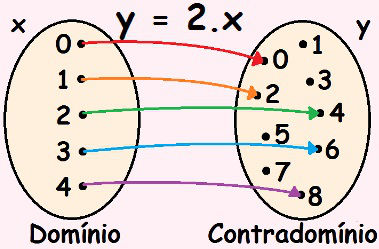
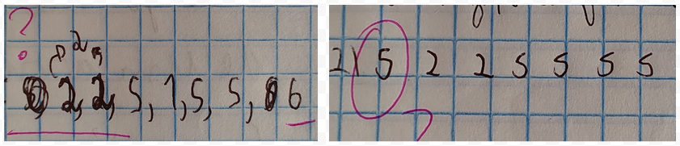

<!--
author:   Andrea Charão

email:    andrea@inf.ufsm.br

version:  0.0.1

language: PT-BR

narrator: Brazilian Portuguese Female

comment:  Material de apoio para a disciplina
          ELC117 - Paradigmas de Programação
          da Universidade Federal de Santa Maria

translation: English  translations/English.md
-->

<!--
nvm use v14.21.1
liascript-devserver --input README.md --port 3001 --live
https://liascript.github.io/course/?https://raw.githubusercontent.com/AndreaInfUFSM/elc117-2024b/master/classes/03/README.md
-->
[](https://liascript.github.io/course/?https://raw.githubusercontent.com/AndreaInfUFSM/elc117-2024b/main/classes/03/README.md)

# Programação Funcional

> Uma introdução ao paradigma de programação funcional, **independente de linguagem**!


Profª Andrea Schwertner Charão<br>
Departamento de Linguagens e Sistemas de Computação<br>
Universidade Federal de Santa Maria<br>


## Programação imperativa X declarativa


- Duas grandes categorias de linguagens de programação: **imperativa** e **declarativa**
- Contraste entre estas categorias ajuda a entender programação funcional

              --{{0}}--
Antes de começarmos a trabalhar com a programação funcional, e sabendo que você têm experiência com a linguagem C, vale conhecer uma classificação de linguagens em 2 grandes classes/famílias/categorias: as linguagens imperativas e as linguagens declarativas. 
A tabela neste slide faz um breve paralelo entre estes conceitos, incluindo links para definições na Wikipedia (vale a pena consultar esses links, mas sem se apegar a detalhes). Os slides seguintes trazem mais informações sobre esta classificação.

| Linguagens imperativas   | Linguagens declarativas   |
| :--------- | :--------- |
| https://en.wikipedia.org/wiki/Imperative_programming     | https://en.wikipedia.org/wiki/Declarative_programming     |
| Ênfase em **como** obter um resultado | Ênfase em descrever **o quê** queremos obter |
| Linguagem C é imperativa | Programação funcional é considerada declarativa |


### Programação imperativa

- Programas formados por comandos que alteram o estado de variáveis

- Abstração próxima da [arquitetura de von Neumann](https://en.wikipedia.org/wiki/Von_Neumann_architecture)

  - dados na memória são transferidos para processamento pela CPU
  - programas operam sobre dados em variáveis

- Usamos comandos para "dar ordens" ao computador, como no modo verbal imperativo da língua portuguesa

  - Comandos detalham as ações que o computador deve executar para obter um resultado

  - Ou seja: programação imperativa se concentra em "**como**" o programa deve obter um resultado


- Exemplos: 

  - C e outras "clássicas" (mais antigas) como Fortran, Pascal, BASIC, etc.
  - várias linguagens modernas e populares são predominantemente imperativas, embora multi-paradigma: Java, Python, JavaScript, C++, C#, Rust, etc.

  
### Programação declarativa

- Programas descrevem o resultado que se deseja obter

- Abordagem de mais alto nível, mais distante da arquitetura

- Sem detalhamento de todas ações que o computador deve executar 
  
  - Ou seja, programação declarativa em concentra mais em definir "**o quê**" se deseja obter, e menos em "como" obter o resultado desejado
  - Detalhes de mais baixo nível (alocação, índices, percurso, etc.) ficam a cargo da implementação da linguagem, não de quem programa

- Exemplos:

  - clássicas/antigas como Lisp, Prolog, Scheme, SQL, entre outras
  - mais recentes como Haskell, Clojure, Scala, F#, Elm, Elixir, etc.
  - muitos recursos incorporados em linguagens multi-paradigma como Java, Python, JavaScript, C++, C#, Rust, etc.

### Um exemplo

- Contraste "teórico" entre paradigmas é muito abstrato, costuma levar tempo para ser compreendido
- Praticar e comparar códigos ajuda a entender diferenças
- Na sequência, vamos ver um exemplo com programas equivalentes em C (imperativo) e Haskell (declarativo)

#### Em C 

Linguagem procedimental, imperativa

- O que faz este código?
- Que recursos de linguagem você reconhece?

              --{{0}}--
Este código em C processa uma string para remover hífens (caracter '-'). O resultado é uma nova string com os caracteres da primeira, com exceção dos hífens. Em outras palavras, podemos dizer que o código faz uma filtragem de string.

Código disponível em: https://github.com/AndreaInfUFSM/elc117-2023b/blob/master/classes/02/src/04-abra.c

```C
#include <stdlib.h>
#include <stdio.h>
#include <string.h>

int main() {
  char *sstr = "a-bra-ca-da-bra";
  char *rstr = malloc(strlen(sstr) + 1);

  int rindex = 0;
  for (int i = 0; i < strlen(sstr); i++) {
    if (sstr[i] != '-') {
      rstr[rindex] = sstr[i];
      rindex++;
    }
  }
  rstr[rindex] = '\0';
  printf("%s\n", rstr);
}
```
              --{{0}}--
Apesar de ser uma operação simples, este trecho de código ilustra vários recursos da programação imperativa em C: variáveis, estruturas de repetição e seleção (for, if), alocação de memória, strings, arrays, ponteiros, chamada de funções e saída na tela. Ao programar em C, precisamos cuidar de muitos detalhes sobre como o computador irá executar as operações. Os detalhes até podem ficar escondidos em uma biblioteca, mas a linguagem em si deixa muitas tarefas a cargo de quem programa. Isso faz de C uma linguagem muito poderosa, mas também muito exigente.

#### Em Haskell 

Linguagem funcional, declarativa

- Programa equivalente ao anterior
- Mesmo sem conhecer a linguagem, o que você consegue entender?


```haskell
main = do
  let sstr = "a-bra-ca-da-bra"
  putStrLn (filter (\c -> c /= '-') sstr)
  --putStrLn (filter (/= '-') sstr)
```

              --{{0}}--
Este código em Haskell, com apenas 3 linhas, é equivalente ao código em C. Aqui não precisamos cuidar da alocação de memória e não processamos a string acessando explicitamente seus elementos, um a um. Usamos uma função pré-definida que implementa uma filtragem (um padrão algorítmico que percorre uma lista e aplica uma condição a cada elemento, selecionando apenas os que satisfazem a condição). 

              --{{0}}--
A sintaxe de Haskell é diferente de C, mas você provavelmente consegue deduzir quais são as funções usadas neste código e qual é a string processada. O restante nós veremos durante as aulas.

### Quiz 

1. SQL (Structured Query Language) é considerada uma linguagem declarativa porque, ao fazer uma consulta a um banco de dados, quem programa usa a linguagem para descrever o que deseja obter, mas não como a operação deve ser realizada em termos de algoritmos ou operações detalhadas. 

   - [(x)] Verdadeiro
   - [( )] Falso

2. Qual dos códigos abaixo é declarativo?

   (a)

   ```python
   salaries = [40000, 50000, 60000, 55000, 45000]
   total_salary = 0
   for salary in salaries:
       total_salary += salary
   print(total_salary)  
   ```

   (b)

   ```sql
   SELECT SUM(salary) FROM employees;
   ```

   - [( )] (a)
   - [(x)] (b)


## Características do paradigma funcional

Veremos na sequência um resumo de características do paradigma funcional:

- [Inspiração em funções matemáticas](#inspiração-em-funções-matemáticas)
- [Sem efeitos colaterais](#sem-efeitos-colaterais)
- [Dados imutáveis](#dados-imutáveis)
- [Favorece boas práticas](#favorece-boas-práticas)


              --{{0}}--
Um paradigma não se caracteriza por nenhuma sintaxe de linguagem em particular, mas sim por alguns conceitos/recursos que estão presentes em linguagens que seguem o paradigma. Não existe uma única descrição do que caracteriza a programação funcional, mas os slides que seguem resumem algumas características comumente citadas, independentes de linguagem. Cada link leva para um slide.

### Inspiração em funções matemáticas

- A programação funcional se inspira em características de **funções** em matemática:
  
- Funções estabelecem correspondência entre elementos de 2 conjuntos. Por exemplo:


  $f : Z \rightarrow Z$

  $f(x) = 2 * x$

              --{{0}}--
  Neste exemplo, dada a variável independente $ x $, que designa um elemento do conjunto $ Z $ de números inteiros (domínio), a regra $ 2 * x $ designa um elemento correspondente no contradomínio $ Z $ (mais precisamente, um elemento no subconjunto imagem). 

              --{{0}}--
  Assim, por exemplo, o elemento $ x = 2 $ no conjunto domínio corresponderá a $ f(x) = 4 $ no conjunto imagem.

  

  Fonte: https://brasilescola.uol.com.br/o-que-e/matematica/o-que-e-funcao.htm

#### Mas C tem funções...

- Linguagens imperativas como C aproveitam o conceito de função em subprogramas

- Mas... linguagens imperativas permitem "efeitos colaterais" que se distanciam da matemática

- Funções "puras" (sem efeitos colaterais) possuem vantagens


Função pura:

```C
int func1(int x) { 
  return 2 * x; 
}
```

Funções com efeitos colaterais:

```C
int g = 0;

int func2(int x) {
  printf("%d ", x);
  return 2 * x;
}

int func3(int x) {
  g++;
  return 2 * x;
}

int func4(int *x) {
  int result = *x * 2;
  *x = 2;
  return result;
}
```


### Sem efeitos colaterais

> Na programação funcional, evita-se **efeitos colaterais** (em inglês, *side effect*)


Definição em inglês na Wikipedia: https://en.wikipedia.org/wiki/Side_effect_%28computer_science%29 :

  - *In computer science, an operation, function or expression is said to have a side effect if it modifies some state variable value(s) outside its local environment, which is to say if it has any observable effect other than its primary effect of returning a value to the invoker of the operation.*

Em português: 

  - Em ciência da computação, diz-se que uma operação, função ou expressão tem um efeito colateral se ela modifica uma variável fora de seu ambiente local, ou seja, se tem algum **efeito observável além de seu efeito primário** de retornar um valor para o invocador da operação.

#### Exemplos em C

Ver [código 02](../02/02/side-effect.c) da aula anterior


1. Função em C **sem efeito colateral** (pura), como função matemática:

   ```C
   int func1(int x) { 
     return x + 4; 
   }
   ```

   Semelhante à programação funcional!


2. Função em C **com efeito colateral** (além do resultado, muda o estado da saída padrão):

   ```C
   int func2(int x) {
     printf("%d ", x);
     return x + 4;
   }
   ```
   Programação funcional evita misturar entrada-saída com processamento


3. Função em C **com efeito colateral** (muda estado de variável global):

   ```C
   int g = 0;
   int func3(int x) {
     g++;
     return x + 4;
   }
   ```
   Programação funcional não trabalha com variáveis globais


4. Função em C **com efeito colateral** (muda estado de argumento):

   ```C
   int func4(int *x) {
     int result = *x + 4;
     *x = 2;
     return result;
   }

   ```
   Programação funcional: argumentos só são lidos, não são modificados


#### Motivos para evitar

Efeitos colaterais:

- Podem dificultar compreensão do código
- Podem esconder bugs e dificultar depuração / teste
- Podem ser minimizados com boas práticas de programação
- Podem ser evitados com programação funcional

No código [02](../02/02/side-effect.c) da aula anterior:

- Este código tem muitos efeitos colaterais. Qual será sua saída?

              --{{0}}--
Para responder exatamente qual será a saída deste código, você precisa rastrear todo o fluxo de execução com muita atenção.

              --{{0}}--
Fazer isso é um bom exercício quando se está aprendendo como funciona a execução de um programa, mas quando se está programando profissionalmente, boas práticas prezam por legibilidade e simplicidade (ou seja, você precisa se preocupar não só em escrever um código que funcione, mas que também facilite sua compreensão).

- De 6 grupos que analisaram este código, 4 acertaram, 2 erraram



```C
#include <stdio.h>

int g = 0;

int func1(int x) { 
  return x + 4; 
}

int func2(int x) {
  printf("%d ", x);
  return x + 4;
}

int func3(int x) {
  g++;
  return x + 4;
}

int func4(int *x) {
  int result = *x + 4;
  *x = 2;
  return result;
}

int main() {

  int a, b, c, d, n;
  g = 1;
  n = 1;
  
  a = func1(n);
  b = func2(n);
  c = func3(n);
  d = func4(&n);

  printf("%d %d %d %d %d %d\n", g, n, a, b, c, d);

  return 0;
}
```

### Dados imutáveis

Definição na Wikipedia: https://en.wikipedia.org/wiki/Immutable_object

> *In object-oriented and functional programming, an immutable object is an object whose state cannot be modified after it is created. This is in contrast to a mutable object, which can be modified after it is created.*


| Programação imperativa   | Programação puramente funcional   |
| :--------- | :--------- |
| Dados mutáveis     | Dados imutáveis |
| Estado de variáveis e estruturas de dados é modificado ao longo da execução | Dados são passados como argumento, mas não são modificados | 
| Recursos de linguagem para mutabilidade (ponteiros, por exemplo) | Resultados de funções são criados e retornados pela linguagem. Não existem ponteiros e nem "variáveis" como em C, mas podemos dar nome a valores e expressões  |


#### Programação com dados imutáveis

- Programas compostos por muitas funções
- Funções são encadeadas: uma chama outra, que chama outra, e assim por diante
- O valor de retorno de uma função serve de entrada para outra


Fonte: https://www.huffpost.com/entry/teach-a-kid-functional-pr_b_3666853 (adaptação de Bruno Gottlieb)

### Favorece boas práticas


A programação funcional reforça algumas boas práticas que se aplicam à programação em geral:

1. **Modularidade** de código (organização, legibilidade, manutenção)

   <details>
     <summary style="color:Grey;font-size: smaller">Por quê?</summary>
     <p>Porque todo programa funcional já nasce modular, distribuído em diversas funções, que podem ser agrupadas em módulos/arquivos.</p>
   </details> 

2. **Decomposição** de um problema em partes menores, mais facilmente gerenciáveis

   <details>
     <summary style="color:Grey;font-size: smaller">Por quê?</summary>
     <p>Porque funções sofisticadas podem ser construídas a partir de várias outras mais simples, que já estão prontas ou podem ser criadas e reusadas.</p>
   </details> 


3. Reconhecer e reusar **padrões** algorítmicos (produtividade)

   <details>
     <summary style="color:Grey;font-size: smaller">Por quê?</summary>
     <p>Porque funções genéricas e muito poderosas já vêm definidas, e podemos facilmente definir novas funções genéricas e reusáveis.</p>
   </details> 


4. Facilitar o **teste** do código (qualidade)

   <details>
     <summary style="color:Grey;font-size: smaller">Por quê?</summary>
     <p>Porque testes de unidade automatizados são baseados em funções. Sem efeitos colaterais, uma função que passa em um teste é confiável.</p>
   </details> 
   

### Quiz

1. A linguagem C possui suporte a funções, logo pode ser considerada uma linguagem de programação funcional.

   - [( )] Verdadeiro
   - [(x)] Falso

2. O código em C abaixo causa um efeito colateral, pois modifica o valor do argumento recebido pela função, sendo que essa modificação será percebida pelo código que chamou a função.

   ```c
   int func(int *x) {     
     *x = *x + 1;
     int result = *x + 2;
     return result;
   }
   ```

   - [(x)] Verdadeiro
   - [( )] Falso


2. O código em C abaixo causa um efeito colateral.

   ```c
   int func(int x) {     
     x = 2 * x;
     int result = x + 1;
     return result;
   }
   ```

   - [( )] Verdadeiro
   - [(x)] Falso


## Recursos da programação funcional

Independentemente de sintaxe, linguagens com suporte à programação funcional têm alguns recursos em comum.


Alguns recursos que você pode encontrar em toda linguagem de programação funcional:

- [Recursos básicos](#básicos)
- [Higher order functions](#higher-order-functions)
- [Lambda / anonymous functions](#lambda--anonymous-functions)
- [Outros recursos](#outros-recursos)

              --{{0}}--
Quando você estiver conhecendo uma nova linguagem e souber que ela suporta programação funcional, você pode esperar encontrar alguns recursos de programação característicos deste paradigma. A sintaxe particular vai mudar de uma linguagem para outra, mas os conceitos permanecem válidos. Os slides que seguem resumem alguns recursos que veremos com a sintaxe de Haskell, mas que encontram-se também em outras linguagens de programação funcional. Cada link leva para um slide.


### Básicos

<!-- data-type="none" -->
| Recurso   | Exemplo (notação matemática)  |
| :--------- | :--------- |
| Definição de função     | $$ f(x) = x + 4 $$    |
| Aplicação (uso) de função     | $$ f(1) $$    |
| Composição de funções     | $$ f .  g (x) = f(g(x)) $$    |
| Definição condicional     | $$ f(x) = \begin{cases}
   x^2 + 1 &\text{se } x >= 0 \\
   0 &\text{se } x < 0
\end{cases} $$   |
| Definição recursiva     | $$ f(x) = \begin{cases}
   1 &\text{se } x = 0 \\
   x * f(x-1)  &\text{se } x > 0
\end{cases} $$    |


### Higher order functions

> São funções que:
>
> - recebem uma ou mais funções como argumento
> - e/ou retornam função como resultado


- Definição na Wikipedia: https://en.wikipedia.org/wiki/Higher-order_function

  - Em português: "funções de ordem superior" ou "funções de alta ordem"
  - Contraste com funções básicas que são "*first-order functions*" (funções de primeira ordem)

- Muito poderosas e vantajosas (código reusável, produtividade, etc.)

#### Exemplos

Exemplos de funções de alta ordem presentes em diferentes linguagens: 

> filter, map, fold / reduce, sortBy, zipWith, etc.


Exemplo com `filter` em Haskell:


```haskell
sstr = "a-bra-ca-da-bra"
putStrLn (filter (/= '-') sstr)
```

Exemplo com `filter` em Python:

```python
sstr = "a-bra-ca-da-bra"
print(''.join(filter(lambda c: c != '-', sstr)))
```


### Lambda / anonymous functions


> São funções sem nome, definidas na hora do uso

- Definição na Wikipedia: https://en.wikipedia.org/wiki/Anonymous_function

- Também conhecidas como "lambda functions"

- Recurso de programação funcional que foi incorporado na maioria das linguagens imperativas modernas


Exemplo com lambda em Haskell `(\ -> )`:


```haskell
main = do
  let sstr = "a-bra-ca-da-bra"
  putStrLn (filter (\c -> c /= '-') sstr)
```

Exemplo com `lambda` em Python:

```python
sstr = "a-bra-ca-da-bra"
print(''.join(filter(lambda c: c != '-', sstr)))
```

### Outros recursos

- Linguagens de programação funcional costumam ter outros recursos muito interessantes e avançados

  - do ponto de vista de quem programa e também de quem implementa/desenvolve a linguagem (quem desenvolve compiladores, interpretadores, bibliotecas e frameworks)

- Exemplos: list comprehension, lazy evaluation, currying / partial application, eta conversion, monads, etc.

- Partindo do básico, vale explorar particularidades de cada linguagem

### Quiz

1. Recursos para expressar condições estão presentes na programação funcional.

   - [(x)] Verdadeiro
   - [( )] Falso

2. Funções anônimas são definidas no local em que são usadas, ou seja, não são definidas em outra parte do programa, como em C.

   - [(x)] Verdadeiro
   - [( )] Falso

3. Em C, não é possível passar uma função como argumento para outra função.

   - [( )] Verdadeiro
   - [(x)] Falso

4. Um programa que mostra "Hello, World" na tela é um bom exemplo introdutório do paradigma de programação funcional.

   - [( )] Verdadeiro
   - [(x)] Falso


## Linguagens

Na sequência, uma visão geral das opções de linguagens para programação funcional:

- [Evolução](#evolução)
- [Linguagem Lisp](#lisp)
- [Linguagem Haskell](#haskell)
- [Muitas outras linguagens](#muitas-outras-linguagens)


              --{{0}}--
 Os slides que seguem resumem alguns pontos importantes sobre a evolução das linguagens de programação funcional. Cada link leva para um slide.

### Evolução

              --{{0}}--
Você já parou para pensar que, assim como seres vivos, linguagens de programação têm um ciclo de vida: nascem, crescem, possivelmente se reproduzem e morrem ?

              --{{0}}--
Para conhecer o passado, entender o presente e contribuir com o futuro, vale muito conhecer pelo menos um pouco sobre a evolução das linguagens de programação ao longo do tempo.

Na linha do tempo abaixo, onde será que se situam as linguagens de programação funcional?
<details>
  <summary style="color:Grey;font-size: smaller">Descubra</summary>
  <p>Lisp é considerada a primeira linguagem de programação funcional (\~1958). Fortran (linguagem imperativa) foi criada alguns anos antes (\~1954), na mesma década. Já a linguagem C foi criada pouco mais de uma década depois (\~1971).</p>
</details> 


![Gráfico representando uma linha do tempo da evolução de linguagens de programação. No eixo X, anos de 1954 a 2001. No eixo Y, famílias de linguagens de programação, com 30 linhas horizontais mostrando a evolução (versões) de linguagens de cada família. Algumas linguagens adicionais são mostradas como pontos por não terem descendentes. Linhas diagonais interligam linguagens que influenciaram / foram influenciadas por outras. Cores diferentes indicam linguagens ativas, extintas ou ameaçadas de extinção. Infelizmente, a imagem não está atualizada com linguagens que surgiram após 2001, mas serve para ilustrar a ideia de um ciclo de vida.](img/ComputerLanguagesChart-med.png)

Fonte: https://digibarn.com/collections/posters/tongues/ (página desatualizada, mas com informações valiosas)


#### Outros históricos

Sites sobre a evolução das linguagens de programação:

- Timeline of programming languages: https://en.wikipedia.org/wiki/Timeline_of_programming_languages
- Online Historical Encyclopaedia of Programming Languages: http://hopl.info/ (tem uma grande árvore genealógica)
- Computer Languages History: https://www.levenez.com/lang/
- PLDB - a Programming Language Database. A computable encyclopedia about programming languages: https://github.com/breck7/pldb (sugestão de mvisentini - *in memoriam*)


### Lisp


Linguagem Lisp (**lis**t **p**rocessor)

- na Wikipedia: https://en.wikipedia.org/wiki/Lisp_%28programming_language%29
- criada por John McCarthy, MIT (~1958), um dos "pais" da Inteligência Artificial
- voltada para processamento de listas
- adotada por precursores da área de IA
- vários dialetos (GNU Lisp, C Lisp, etc.)

Exemplo:

```lisp
(print (car (list 1 2 3)))
(print (cdr (list 1 2 3)))
```

Resultado:

```lisp
1
(2 3)
```

Observações:

- Função `car`: retorna primeiro elemento da lista (head)
- Função `cdr`: retorna o restante da lista, sem o primeiro (tail)


### Haskell

Conforme  https://haskell.org:

> *An advanced, purely functional programming language*


- Linguagem **puramente** funcional
- Justamente por isso, muito contrastante com outras linguagens imperativas ou multi-paradigma
- Justamente por isso, uma boa escolha para praticar este paradigma


Exemplo:

```haskell
main = do
  print (head [1,2,3])
  print (tail [1,2,3])
```

Resultado:

```haskell
1
[2,3]
```

Observações:

- Função `head`: retorna primeiro elemento da lista 
- Função `tail`: retorna o restante da lista, sem o primeiro 


### Muitas outras linguagens

- Muitas linguagens não são puramente funcionais, mas oferecem recursos de programação funcional
- Linguagens populares atualmente:

  - Python, JavaScript/TypeScript, Java, C#: são multi-paradigma, com recursos de programação funcional

- Outras modernas mas não muito conhecidas:

  - Clojure, Scala, F#, Erlang, Elixir, etc.


## Bibliografia


Bibliografia básica:

-  Robert Sebesta. Conceitos de Linguagens de Programação. Bookman, 2018. Disponível no Portal de E-books da UFSM: http://portal.ufsm.br/biblioteca/leitor/minhaBiblioteca.html

  - Capítulo 15: Programação Funcional
  - Capítulos anteriores: recursos de linguagens imperativas


Leituras complementares:


- Nubank. [O que é programação funcional e o que isso tem a ver com o Nubank?](https://blog.nubank.com.br/programacao-funcional-o-que-e-relacao-nubank/)

  um artigo da equipe de desenvolvimento da Nubank


- John Pavley. [Teach a Kid Functional Programming and You Feed Her for a Lifetime](http://www.huffingtonpost.com/john-pavley/teach-a-kid-functional-pr_b_3666853.html)

  um artigo opinativo para público não especializado

- Richard Pawson. [Confused about: Subroutine, Procedure, Function, and Method?](https://www.computingatschool.org.uk/news-and-blogs/2023/july/confused-about-subroutine-procedure-function-and-methodeur) 

  um artigo para professores de Educação Básica (!) no Reino Unido
