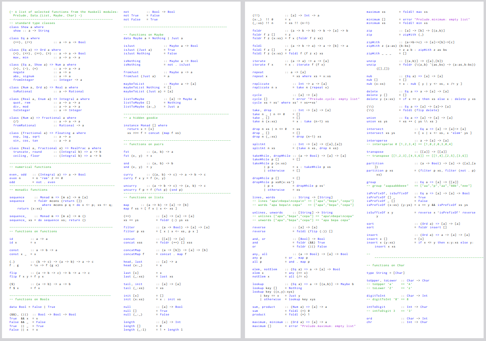

<!--
author:   Andrea Charão

email:    andrea@inf.ufsm.br

version:  0.0.1

language: PT-BR

narrator: Brazilian Portuguese Female

comment:  Material de apoio para a disciplina
          ELC117 - Paradigmas de Programação
          da Universidade Federal de Santa Maria

translation: English  translations/English.md

link:     https://cdn.jsdelivr.net/chartist.js/latest/chartist.min.css

script:   https://cdn.jsdelivr.net/chartist.js/latest/chartist.min.js


-->

<!--
nvm use v14.21.1
liascript-devserver --input README.md --port 3001 --live
https://liascript.github.io/course/?https://raw.githubusercontent.com/AndreaInfUFSM/elc117-2023b/master/classes/03b/README.md
-->

[](https://liascript.github.io/course/?https://raw.githubusercontent.com/AndreaInfUFSM/elc117-2024b/main/classes/04/README.md)

# Programação Funcional em Haskell


> Este material é uma introdução à **programação funcional** em Haskell.
>
> O conteúdo tem partes interativas e pode ser visualizado de vários modos usando as opções no topo da página.


Fonte: https://www.haskell.org/

## Highlights da linguagem

Alguns destaques da linguagem (contraste com C):

- Criada em ~1987, vários autores, nome em homenagem a matemático Haskell Curry
- Linguagem puramente funcional (funções sem efeitos colaterais)
- Fortemente tipada, mas com inferência de tipos
- Suporta **listas** nativamente (estrutura/tipo de dado nativo)
- Ambiente de execução: compilador e ambiente interpretador interativo (GHCi)


![Gráfico representando uma linha do tempo da evolução de linguagens de programação. No eixo X, anos de 1954 a 2001. No eixo Y, famílias de linguagens de programação, com 30 linhas horizontais mostrando a evolução (versões) de linguagens de cada família. Algumas linguagens adicionais são mostradas como pontos por não terem descendentes. Linhas diagonais interligam linguagens que influenciaram / foram influenciadas por outras. Cores diferentes indicam linguagens ativas, extintas ou ameaçadas de extinção. Infelizmente, a imagem não está atualizada com linguagens que surgiram após 2001, mas serve para ilustrar a ideia de um ciclo de vida.](img/ComputerLanguagesChart-med.png)

Fonte: https://digibarn.com/collections/posters/tongues/


## Ambiente de execução


Para instalação local

- Download oficial em https://www.haskell.org/downloads/
- Compilador GHC, ambiente interativo GHCi, pacotes de bibliotecas, gerenciadores de dependência cabal / stack, etc.  
- Pode ser assustador para iniciantes :-)


Em nuvem (online)

- Ambientes em nuvem que oferecem maior controle, com experiência próxima ao ambiente local: 

  - [GitHub Codespaces](https://github.com/codespaces)
  - [Play with Docker](https://labs.play-with-docker.com/)
  - [Repl.it](https://replit.com)
  - qualquer outro com livre acesso a containers

- (Evite!) Ambientes simplificados que escondem interação com GHCi:

  - https://www.jdoodle.com/execute-haskell-online
  - https://onecompiler.com/haskell, 
  - https://play.haskell.org/
  - https://www.onlinegdb.com/online_haskell_compiler
  - https://www.tutorialspoint.com/compile_haskell_online.php
  

### Acesse Codespaces

1. Faça login em sua conta no GitHub
2. Acesse https://github.com/codespaces
3. Você verá seus codespaces à esquerda, depois de seguir as instruções na seção [Prática](#prática)

### Acesse "Play with Docker"


1. Acesse https://labs.play-with-docker.com/
2. Crie uma conta / faça Login
3. Clique em Start
4. Clique em "+ ADD NEW INSTANCE"
5. No terminal, digite: `docker run -it haskell bash`
6. Aguarde a instalação
7. No terminal, digite `ghci` 


## Aplicando funções pré-definidas

- Programação funcional aplica funções a argumentos (como em matemática)
- Módulo (biblioteca) default chamado Prelude tem muitas funções pré-definidas



Fonte: https://datateknik-lth.github.io/courses/EDAN40-functional/edan40-prelude-cheat-sheet.pdf

### Sintaxe geral

> Sintaxe para aplicar função a argumentos: 
> 
> `nomefunc arg1 ... argn`


Dissecando o código:

- Sintaxe geral sem parênteses, sem vírgula, sem ponto-e-vírgula
- Linguagem case-sensitive, portanto tenha atenção ao nome da função!
- Funções podem ter zero ou mais argumentos
- Quando necessário, parênteses podem ser usados para expressar precedência


Exemplos no ambiente interativo GHCi:

``` text
GHCi, version 9.0.2: http://www.haskell.org/ghc/  :? for help
Prelude> sqrt 4
2.0
Prelude> sqrt 4-1
1.0
```


### Exemplos

Parênteses alteram a ordem de precedência das operações!

``` text
GHCi, version 9.0.2: http://www.haskell.org/ghc/  :? for help
Prelude> sqrt 4-1
1.0
Prelude> sqrt (4-1)
1.7320508075688772
```

Mais exemplos:

``` text
Prelude> min 16 8
8
Prelude> 4^2
16
```

### Teste outros exemplos

> Você consegue descobrir o que fazem estas funções?


Digite os exemplos 1 a 5, um de cada vez:

1. `min 9 8`
2. `sqrt (max 9 8)`
3. `min "abc" "def"`
4. `min "abcdef" "def"`
5. `length (min "abcd" "ab")`


## Definindo funções simples (sem tipos)


- Sintaxe para definir funções é simples, difere bastante da linguagem C
- Como em C, usamos símbolos para expressar o nome dos argumentos

### Sintaxe geral

Sintaxe geral para definir uma função **não-tipada** / **sem tipo explícito**:

`nomefunc arg1 ... argn = expressão`

Exemplos no ambiente interativo GHCi:

``` text
GHCi, version 9.0.2: http://www.haskell.org/ghc/  :? for help
Prelude> f x = x+4
Prelude> f 3
7
Prelude> f 8.5
12.5
Prelude> f 3.0
7.0
```

> Qual o tipo do argumento `x`? Não é explícito, está sendo inferido!


### Teste outros exemplos

No GHCI, digite as seguintes definições:

1. `soma x y = x + y`
2. `hipotenusa c1 c2 = sqrt (c1^2+c2^2)`
3. `isSpace c = c == ' '`

Em seguida digite as seguintes aplicações das funções:

1. `soma 8 9`
2. `soma 3 1.5`
3. `hipotenusa 2 4`
4. `isSpace 'a'`


### Erros acontecem...


Digite as seguintes definições de funções:

1. `inc x = x + 1`
2. `plural word = word ++ "s"`

Digite as seguintes aplicações das funções, que vão gerar erro!

1. `inc "abcd"`
2. `plural 2`

> Você consegue identificar o motivo de cada erro?


## Funções de alta ordem (higher order)

- São funções que recebem outras funções como argumento e/ou produzem funções como resultado
- Muito poderosas pois implementam definições genéricas  que podem ser facilmente especializadas (algoritmos reutilizáveis)
- Exemplos clássicos: `map` e `filter` (mas existem muuuuitos outros!)
- Muitas dessas funções manipulam **listas**.


### Antes: listas

- Em Haskell, uma lista é um conjunto de dados de um mesmo tipo
- Ou seja: em Haskell, listas são **homogêneas**
- Sintaxe: delimitação por colchetes, valores separados por vírgula
- String é lista de Char!

Exemplos:

- `[1,2,3,4]` : lista de inteiros
- `['a', 'b']` : lista de caracteres (String)
- `"ab"` : forma abreviada de lista de caracteres (String)


### Função `map`

- Recebe 2 argumentos: uma função e uma lista
- Aplica a função a cada elemento da lista, inserindo cada resultado na lista resultante
- Função passada como argumento deve ser compatível com elementos da lista 
- Lista resultante terá sempre mesmo tamanho da lista de entrada

Exemplo 1: Função que adiciona uma constante

``` text
GHCi, version 9.0.2: http://www.haskell.org/ghc/  :? for help
Prelude> func x = x + 4
Prelude> func 3
7
Prelude> map func [1,2,3]
[5,6,7]
```

Exemplo 2: Funções booleanas que comparam caracter com espaço

``` text
GHCi, version 9.0.2: http://www.haskell.org/ghc/  :? for help
Prelude> nospace c = c /= ' '
Prelude> space c = c == ' '
Prelude> nospace 'a'
True
Prelude> nospace ' '
False
Prelude> map nospace "abc"
[True,True,True]
Prelude> map nospace "ha ha"
[True,True,False,True,True]
```
> Relembrando: Tipo `String` em Haskell é equivalente a `[Char]` (lista de caracteres)


### Função `filter`

- Recebe 2 argumentos: uma função booleana (tipo `Bool`, valores `True`/`False`) e uma lista
- Aplica a função a cada elemento da lista, inserindo na lista de saída somente os elementos que resultarem `True`
- Ou seja; é uma função que seleciona elementos que satisfazem uma condição
- Lista resultante terá tamanho igual ou menor ao da lista de entrada

Exemplo: Usando map e filter

``` text
GHCi, version 9.0.2: http://www.haskell.org/ghc/  :? for help
Prelude> nospace c = c /= ' '
Prelude> filter nospace "ha ha"
"haha"
Prelude> map nospace "ha ha"
[True,True,False,True,True]
```

Exemplo: Usando `:t` para verificar o tipo de uma função

``` text
Prelude> let nospace c = c /= ' '
Prelude> :t nospace
nospace :: Char -> Bool
Prelude> :t map
map :: (a -> b) -> [a] -> [b]
Prelude> :t filter
filter :: (a -> Bool) -> [a] -> [a]
```


## Funções tipadas

- Programas em Haskell geralmente definem funções tipadas
- Definições de funções tipadas geralmente são agrupadas em arquivos
- Arquivos de programas Haskell têm extensão `.hs` (exemplo: `Main.hs`)
- Arquivo pode ser carregado no ambiente interativo com o comando `ghci Main.hs`


### Sintaxe geral

              --{{0}}--
Funções tipadas em Haskell têm uma sintaxe bem diferente do que encontramos em outras linguagens. A forma geral tem 2 (ou mais linhas): a primeira linha define uma "assinatura" da função, com nome e tipos envolvidos. O último tipo nesta linha corresponde ao tipo do resultado da função. Na segunda linha vem o código da função propriamente dita (escrito como vimos inicialmente, para funções não tipadas).

              --{{0}}--
Ao contrário do que acontece em C, os tipos e nomes de argumentos não ficam juntos na mesma linha. Então, como sabemos quem é quem? Pela posição! Por exemplo, na função `cube`, temos `Int` e `Int ` na primeira linha. O primeiro `Int` é o tipo do `x`, que é o primeiro (e único) argumento da função. O segundo `Int` é o tipo do resultado da função (tipo do resultado de `x^3`).

              --{{0}}--
Já na função `add`, temos 3 `Int` na primeira linha. O primeiro `Int` é o tipo do `x`, que é o primeiro argumento da função. O segundo `Int` é o tipo do `y`, que é o segundo argumento da função. Por fim, o terceiro `Int` é o tipo do resultado da função (tipo de `x + y`).


- Duas linhas: 

  - uma Linha de definição de tipo (signature)
  - outra para a definição do que a função faz

- Argumentos devem corresponder à *signature*/assinatura (quantidade e tipo dos argumentos)

Exemplos:

``` haskell
-- Eleva um numero ao cubo
-- Aqui temos um comentario!
cube :: Int -> Int
cube x = x^3

-- Soma 2 números
add :: Int -> Int -> Int
add x y = x + y

-- Verifica se um numero eh par 
-- Ilustra uso de if/then/else para expressar condicional 
-- A funcao 'mod' retorna o resto da divisao inteira
-- A função seguinte apresenta uma versão melhorada
isEven :: Int -> Bool
isEven n = if mod n 2 == 0 then True else False

-- Versão melhorada da função anterior
-- A comparação == resulta True/False, por isso
-- o if-then-else é desnecessário neste caso
isEvenBetter :: Int -> Bool
isEvenBetter n = mod n 2 == 0
```


### Tipos básicos

              --{{0}}--
Aqui temos um resumo de tipos básicos em Haskell. Todos iniciam com maiúscula.


| Tipo | Descrição | Exemplos de valores |
| ---- | --------- | ------------------- |
| `Bool` | Valores lógicos (verdadeiro/falso) | `True`, `False` |
| `Int` | Inteiros com precisão fixa (com limite superior/inferior) | `0`, `1`, `3`, `-9`, etc. |
| `Integer` | Inteiros com precisão arbitrária | maiores/menores que `Int` |
| `Float` | Reais, precisão simples | `5.5`, `3e-9` (notação científica), etc. |
| `Double` | Reais, precisão dupla | maiores/menores que `Float` |
| `Char` | Caracteres (Unicode) | delimitar com apóstrofe (aspa simples): `'a'`, `'B'`, `'\97'`, etc. |
| `String` | Lista de caracteres, equivalente a `[Char]` | delimitar com aspas duplas: `"abc"`, `""`, etc. |


### Listas

              --{{0}}--
Como já vimos antes, Haskell suporta listas nativamente. Listas conjuntos de dados homogêneos, que contêm dados de um mesmo tipo. O tipo contido em uma lista pode ser um tipo básico ou qualquer outro, podendo inclusive ser uma lista.

- Em Haskell, uma lista é um conjunto de dados de um mesmo tipo
- Ou seja: em Haskell, listas são **homogêneas**
- Sintaxe: delimitação por colchetes, valores separados por vírgula


Exemplos:

| Valor | Tipo |
| ----- | ------ |
| `[1,2,3,4]` | `[Int]` ou `[Integer]` |
| `['a','b']` | `[Char]` ou `String` |
| `"ab"` (sintaxe abreviada) | `[Char]` ou `String` |
| `[[1,2],[3,4]]` | `[[Int]]` (lista aninhada) |
| `[1.5, 7]` | `[Float]` ou `[Double]` |


### Exemplo com listas e saída


Um programa mais completo, que também faz saída na console:

``` haskell
-- Usa função head (pré-definida)
initial :: String -> Char
initial name = head name

-- Usa função map
allInitials :: [String] -> [Char]
allInitials names = map initial names

-- Função principal
main = do
  print (initial "Andrea")
  print (allInitials ["Fulano", "Beltrano"])
```


## Prática

- Nossas práticas em Haskell serão no GitHub Codespaces.
- Para criar seu repositório com os arquivos desta prática, acesse https://classroom.github.com/a/VL0WIWrj


### Código de exemplo 


O código abaixo tem vários exemplos da sintaxe de Haskell que possuem equivalentes em C. Será que você consegue entendê-los? (se ligue nos comentários!)

``` haskell
-- Eleva um numero ao quadrado
-- Aqui temos um comentario!
square :: Int -> Int
square x = x^2

-- Verifica se um numero eh par 
-- Ilustra uso de if/then/else para expressar condicional 
-- A funcao 'mod' retorna o resto da divisao inteira
-- A função seguinte apresenta uma versão melhorada
isEven :: Int -> Bool
isEven n = if mod n 2 == 0 then True else False

-- Versão melhorada da função anterior
-- A comparação == resulta True/False, por isso
-- o if-then-else é desnecessário neste caso
isEvenBetter :: Int -> Bool
isEvenBetter n = mod n 2 == 0

-- Gera um numero a partir de um caracter 
-- Note esta estrutura condicional em Haskell, usando 'guardas' (|)
encodeMe :: Char -> Int
encodeMe c 
   | c == 'S'  = 0
   | c == 'N'  = 1
   | otherwise = undefined

-- Calcula o quadrado do primeiro elemento da lista
-- Note que '[Int]' designa uma lista de elementos do tipo Int 
squareFirst :: [Int] -> Int
squareFirst lis = (head lis)^2

-- Verifica se uma palavra tem mais de 10 caracteres
isLongWord :: String -> Bool -- isso é o mesmo que: isLongWord :: [Char] -> Bool
isLongWord s = length s > 10
```   

### Execução (Main.hs)

- No repositório do GitHub Codespaces criado para esta aula, você encontra o código anterior no arquivo `Main.hs`.  

- Carregue o arquivo digitando `ghci Main.hs` no terminal.

  - Para sair do GHCi: `Ctrl-D`
  - Para se livrar dos warnings, saia do GHCi e digite no terminal: 
  
    `echo ":set -Wno-x-partial"  > /root/.ghc/ghci.conf`

#### Teste interativamente 

- No GHCi, teste interativamente as funções em cada um dos casos abaixo: 

  - `square 2 + 1`
  - `square (2+1)`
  - `isEven 8`
  - `isEven 9`
  - `encodeMe 'S'`
  - `squareFirst [-3,4,5]`
  - `isLongWord "test"`

#### Cometa erros

- Agora teste as aplicações de funções abaixo. Elas vão gerar **erros**. Você consegue deduzir os motivos em cada caso?

  - `sQUARE 2`
  - `square 'A'`
  - `isEven 8.1`
  - `encodeMe "A"`
  - `squareFirst []`
  - `isLongWord 'test'`


### Definindo minhas funções (MyFunctions1.hs)

Instruções

- Nos exercícios a seguir, você vai definir **funções tipadas** dentro do arquivo `MyFunctions1.hs`.  
- Para testar suas funções, você vai usar o GHCi pelo terminal, digitando:

  ```
  ghci MyFunctions1.hs
  ```
- Quando modificar o arquivo, saia do GHCi (Ctrl-D) e carregue o arquivo novamente.

- Você pode usar teclas de setas no terminal para navegar por comandos anteriores sem ter que digitá-los.


#### Lista de funções

1. Crie uma função `sumSquares :: Int -> Int -> Int` que receba dois números x e y e calcule a soma dos seus quadrados.

2. Defina a função `circleArea :: Float -> Float` que receba um raio r e calcule a área de um círculo com esse raio, dada por pi vezes o raio ao quadrado. Dica: Haskell tem a função `pi` pré-definida.

3. Defina uma função `age :: Int -> Int -> Int` que receba o ano de nascimento de uma pessoa e o ano atual, produzindo como resultado a idade (aproximada) da pessoa.

4. Defina uma função `isElderly :: Int -> Bool` que receba uma idade e resulte verdadeiro caso a idade seja maior que 65 anos.


5. Defina uma função `htmlItem :: String -> String` que receba uma `String` e adicione tags `<li>` e `</li>` como prefixo e sufixo, respectivamente. Por exemplo, se a entrada for `"abc"`, a saída será `"<li>abc</li>"`. Use o operador `++` para concatenar strings (este operador serve para concatenar quaisquer listas do mesmo tipo).

6. Crie uma função `startsWithA :: String -> Bool` que receba uma string e verifique se ela inicia com o caracter `'A'`.

7. Defina uma função `isVerb :: String -> Bool` que receba uma string e verifique se ela termina com o caracter `'r'`. Antes desse exercício, teste no interpretador a função pré-definida `last`, que retorna o último elemento de uma lista. Dica: conheça também o [list monster](http://s3.amazonaws.com/lyah/listmonster.png), do autor Miran Lipovača :-)

8. Crie uma função `isVowel :: Char -> Bool` que receba um caracter e verifique se ele é uma vogal minúscula.

9. Crie uma função `hasEqHeads :: [Int] -> [Int] -> Bool` que verifique se 2 listas possuem o mesmo primeiro elemento. Use a função `head` e o operador lógico `==` para verificar igualdade.

10. A função pré-definida `elem` recebe um elemento e uma lista, e verifica se o elemento está presente ou não na lista. Teste essa função no interpretador: 

   ``` haskell
   elem 3 [1,2,3]
   elem 4 [1,2,3]
   elem 'c' "abcd"
   elem 'A' "abcd"
   ```

   Agora use a função `elem` para implementar uma função `isVowel2 :: Char -> Bool` que verifique se um caracter é uma vogal, tanto maiúscula como minúscula.


### Funções de alta ordem (MyFunctions2.hs)


Instruções

- Nos exercícios a seguir, você deve usar as **funções de alta ordem** `map` e `filter`.

- Você vai preencher o código dentro do arquivo `MyFunctions2.hs`.

- Os exercícios vão usar funções definidas em partes anteriores desta prática. As funções que estão no arquivo anterior (`MyFunctions1.hs`) ficarão acessíveis devido ao `import`. Já as funções definidas em `Main.hs` deverão ser copiadas para o arquivo `MyFunctions2.hs`, conforme as instruções de cada exercício.


#### Lista de funções

1. Crie uma função `itemize :: [String] -> [String]` que receba uma lista de nomes e aplique a função `htmlItem` em cada nome.

2. Crie uma função `onlyVowels :: String -> String` que receba uma string e retorne outra contendo somente suas vogais. Por exemplo: `onlyVowels "abracadabra"` vai retornar `"aaaaa"`.

3. Escreva uma função `onlyElderly :: [Int] -> [Int]` que, dada uma lista de idades, selecione somente as que forem maiores que 65 anos.

4. Crie uma função `onlyLongWords :: [String] -> [String]` que receba uma lista de strings e retorne somente as strings longas (use a função `isLongWord` definida no código de exemplo no início da prática).

5. Escreva uma função `onlyEven` que receba uma lista de números inteiros e retorne somente aqueles que forem pares. Agora é com você a definição da tipagem da função!

6. Escreva uma função `onlyBetween60and80` que receba uma lista de números e retorne somente os que estiverem entre 60 e 80, inclusive. Você deverá criar uma função auxiliar `between60and80` e usar `&&` para expressar o operador "E" lógico em Haskell.

7. Crie uma função `countSpaces` que receba uma string e retorne o número de espaços nela contidos. Dica 1: você vai precisar de uma função que identifica espaços. Dica 2: aplique funções consecutivamente, isto é, use o resultado de uma função como argumento para outra. 

8. Escreva uma função `calcAreas` que, dada uma lista de valores de raios de círculos, retorne uma lista com a área correspondente a cada raio.


### Extra (TestMyFunctions.hs)

- O programa `TestMyFunctions.hs` usa uma biblioteca de teste automatizado de software (HUnit) para testar as funções que você criou.

- Para instalar a biblioteca, digite no terminal:

  ```
  cabal update && cabal install --lib HUnit
  ```

- Para executá-lo, digite o seguinte no terminal:

  ```
  runhaskell TestMyFunctions.hs
  ```

- Se tudo der certo, a saída será a seguinte:
  
  ``` text
  Running tests...
  Cases: 10  Tried: 10  Errors: 0  Failures: 0
  Cases: 8  Tried: 8  Errors: 0  Failures: 0
  ```


## Bibliografia

- [Learn You a Haskell for Great Good!](http://learnyouahaskell.com/) by Miran Lipovača - Ótimo tutorial sobre Haskell e programação funcional

- [Teach a Kid Functional Programming and You Feed Her for a Lifetime](http://www.huffingtonpost.com/john-pavley/teach-a-kid-functional-pr_b_3666853.html) by John Pavley - Um artigo opinativo para público não especializado


