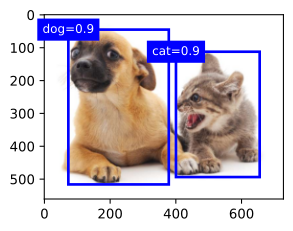

<!--
author:   Andrea Charão

email:    andrea@inf.ufsm.br

version:  0.0.1

language: PT-BR

narrator: Brazilian Portuguese Female

comment:  Material de apoio para a disciplina
          ELC117 - Paradigmas de Programação
          da Universidade Federal de Santa Maria

translation: English  translations/English.md

link:     https://cdn.jsdelivr.net/chartist.js/latest/chartist.min.css

script:   https://cdn.jsdelivr.net/chartist.js/latest/chartist.min.js


-->

<!--
nvm use v14.21.1
liascript-devserver --input README.md --port 3001 --live
https://liascript.github.io/course/?https://raw.githubusercontent.com/AndreaInfUFSM/elc117-2023b/master/classes/08/README.md
-->

[](https://liascript.github.io/course/?https://raw.githubusercontent.com/AndreaInfUFSM/elc117-2024b/main/classes/08/README.md)


# Programação Funcional em Haskell

> Exercícios, muitos exercícios!

## Primeira lista


### Contexto


A visão computacional é um campo da inteligência artificial que avançou muito nos últimos anos, utilizando algoritmos de aprendizagem de máquina para interpretar e entender o conteúdo de imagens e vídeos. Uma das tarefas fundamentais na visão computacional é a **detecção de objetos**, que envolve localizar e identificar objetos de interesse dentro de uma imagem ou um vídeo.

O processo de detecção de objetos pode ser visto como uma função, onde a entrada é uma imagem e a saída consiste nos seguintes dados para cada objeto detectado:

- **Bounding boxes**: São retângulos ou caixas delimitadoras que representam a localização de objetos detectados em uma imagem. Cada bounding box é definida por quatro coordenadas (x1,y1,x2,y2), que correspondem aos cantos superior esquerdo e inferior direito da caixa. As bounding boxes ajudam a indicar onde os objetos estão localizados na imagem.
- **Scores**: Para cada bounding box, um score é atribuído, representando a confiança do modelo na detecção do objeto. Esse score é um valor entre 0 e 1, onde valores mais altos indicam maior confiança de que um objeto foi detectado corretamente. O score é fundamental para filtrar detecções irrelevantes ou errôneas.
- **Classes**: Cada objeto detectado é classificado em uma de várias classes (ou caregorias) pré-definidas. Por exemplo, um modelo treinado para detectar animais pode incluir as classes "dog" e "cat".

A imagem abaixo ilustra bounding boxes (retângulos em torno dos "objetos"), classes ("dog" e "cat") e scores (0.9 para ambos os objetos).



Fonte: http://d2l.ai/chapter_computer-vision/anchor.html

### Dados para teste

Em Haskell, podemos usar listas para representar bounding boxes, scores e classes de objetos.

Essas listas são inter-relacionadas e possuem o mesmo número de elementos, cada elemento correspondente a um objeto detectado. O primeiro elemento em cada uma das listas refere-se ao primeiro objeto, e assim por diante. 

Por exemplo, no código abaixo, o primeiro objeto é da classe 0, com score 0.95 e com bounding box (34.0, 60.0, 200.0, 320.0).

``` haskell
-- Classes: Class 0 or 1 representing two object types
classes :: [Int]
classes = [0, 1, 0]

-- Scores: Confidence scores for each detection
scores :: [Float]
scores = [0.95, 0.80, 0.60]

-- Bounding boxes: (xmin, ymin, xmax, ymax)
boundingBoxes :: [(Float, Float, Float, Float)]
boundingBoxes = [ (34.0, 60.0, 200.0, 320.0),
              	(100.0, 150.0, 250.0, 380.0),
              	(300.0, 220.0, 450.0, 450.0) ]

```


### Questões 1 e 2

<h4>Questão 1</h4>
Crie uma função para obter as bounding boxes de uma dada classe. Essa função deve receber um número representando a classe, a lista de bounding boxes e a lista de classes. Resolva esta função sem usar lambda, só usando outras funções existentes ou que você declarar. Pesquise a função zip, que será útil aqui.

Exemplo de uso:

```
ghci> selectBoundingBoxesForClass 1 boundingBoxes classes
[(100.0,150.0,250.0,380.0)]
```

Nome e tipo da função:

``` haskell
selectBoundingBoxesForClass :: Int -> [(Float, Float, Float, Float)] -> [Int] -> [(Float, Float, Float, Float)]
```

<h4>Questão 2</h4>
Resolva o exercício 1 usando lambda.


### Questões 3 e 4

<h4>Questão 3</h4>
Crie uma função para obter as bounding boxes com scores maiores que um dado valor. Essa função deve receber a lista de bounding boxes, a lista de classes e o valor do limiar.
Resolva esta função sem usar lambda, só usando outras funções existentes ou que você declarar. Pesquise a função zip, que será útil aqui.

Exemplo de uso:

```
ghci> selectBoundingBoxesWithHighScore boundingBoxes scores 0.7
[(34.0,60.0,200.0,320.0),(100.0,150.0,250.0,380.0)]
```

Nome e tipo da função:

``` haskell
selectBoundingBoxesWithHighScore :: [(Float, Float, Float, Float)] -> [Float] -> Float -> [(Float, Float, Float, Float)]
```
<h4>Questão 4</h4>
Resolva o exercício 3 usando lambda.

### Questões 5 e 6


<h4>Questão 5</h4>
Crie uma função para converter a lista de bounding boxes para outro formato: em vez de representar cada bounding box como (xmin, ymin, xmax, ymax), usar a representação (xmin, ymin, width, height), sendo width = xmax - xmin e height = ymax - ymin
Resolva esta função sem usar lambda.

Exemplo de uso:

```
ghci> convertBoundingBoxes boundingBoxes
[(34.0,60.0,166.0,260.0),(100.0,150.0,150.0,230.0),(300.0,220.0,150.0,230.0)]
```

Nome e tipo da função:

``` haskell
convertBoundingBoxes :: [(Float, Float, Float, Float)] -> [(Float, Float, Float, Float)]
```


<h4>Questão 6</h4>
Resolva o exercício 5 usando lambda.


### Questões 7 e 8

<h4>Questão 7</h4>

Crie uma função para validar a lista de bounding boxes. Uma bounding box é válida se x2 >= x1 e y2 >= y1. A função retornará True se todas as bounding boxes da lista forem válidas, ou False em caso contrário.
Resolva esta função sem usar lambda.

Exemplo de uso:

```
ghci> areBoundingBoxesValid boundingBoxes
True
ghci> areBoundingBoxesValid [(1,2,3,4),(3,4,1,2)]
False
```

Nome e tipo da função:

``` haskell
areBoundingBoxesValid :: [(Float, Float, Float, Float)]  -> Bool
```

<h4>Questão 8</h4>
Resolva o exercício 7 usando lambda.


### Questões 9 e 10

<h4>Questão 9</h4>

Crie uma função que receba uma lista de bounding boxes e calcule o somatório das áreas dessas bounding boxes. Resolva esta função sem usar lambda.

Exemplo de uso:

```
ghci> sumAreasOfBoundingBoxes boundingBoxes
112160.0
```

Nome e tipo da função:

``` haskell
sumAreasOfBoundingBoxes :: [(Float, Float, Float, Float)] -> Float
```


<h4>Questão 10</h4>

Resolva o exercício 9 usando lambda.


### Questões 11 e 12

<h4>Questão 11</h4>


Crie uma função para obter a quantidade de objetos de uma determinada classe. Essa função deve receber um número representando uma classe e uma lista de classes.
Resolva esta função sem usar lambda.

Exemplo de uso:

```
ghci> countObjectsForClass 0 classes
2
```

Nome e tipo da função:

```
countObjectsForClass :: Int -> [Int] -> Int
```

<h4>Questão 12</h4>
Resolva o exercício 11 usando lambda.


### Questões 13 e 14

<h4>Questão 13</h4>

Crie uma função para obter possíveis bounding boxes inválidas na lista de bounding boxes. Uma bounding box é inválida se x2 < x1 ou y2 < y1. 
Resolva esta função sem usar lambda.

Exemplo de uso:

```
ghci> getInvalidBoundingBoxes boundingBoxes
[]
ghci> getInvalidBoundingBoxes [(1.0,2.0,3.0,4.0),(3.0,4.0,1.0,2.0)]
[(3.0,4.0,1.0,2.0)]
```

Nome e tipo da função:

``` haskell
getInvalidBoundingBoxes :: [(Float, Float, Float, Float)] -> [(Float, Float, Float, Float)]
```

<h4>Questão 14</h4>
Resolva o exercício 13 usando lambda.


## Segunda lista

Novidades: 

- [list comprehension em Haskell](https://dev.to/awwsmm/relearn-you-a-haskell-part-2-list-comprehensions-tuples-and-types-g29)
- uso de `$`


Para responder às questões, considere o seguinte código em Haskell:

``` haskell
funq1 :: [String] -> Int
funq1 xs = length $ filter (\x -> last x /= 's') xs

funq2 :: [Int] -> Int
funq2 lis = sum (zipWith (*) lis [2^x | x <- [n-1, n-2..]] )
  where n = length lis

funq3 :: String -> Int
funq3 str = sum $ map (\c -> if c == 's' then 1 else 0) str

funq4 :: [(String, Int)] -> Int
funq4 ts = x + y
  where x = sum [length (fst t) | t <- ts ]
        y = foldl1 (+) [snd t | t <- ts ]
        
```


### Questão 1

Qual será o resultado?

``` haskell
funq1 ["sabores", "salada", "menu", "legumes", "lasanha"]
```

### Questão 2

Qual será o resultado?

``` haskell
funq2 [1,0,0]
```


### Questão 3

Qual será o resultado?

``` haskell
funq3 "ufsm"
```


### Questão 4

Qual será o resultado?

``` haskell
funq4 [("alice",10),("bob",15),("dave", 35)]
```


### Questão 5

Qual será o resultado?

``` haskell
funq1 ["In", "the", "world", "of", "computing,", "the", "only", "constant", "is", "change."]
```

### Questão 6

Qual será o resultado?

``` haskell
funq2 [1,0,0,1]
```


### Questão 7

Qual será o resultado?

``` haskell
funq3 $ concat ["In", "the", "world", "of", "computing,", "the", "only", "constant", "is", "change."]
```


### Questão 8

Qual será o resultado?

``` haskell
[("React",2013),("Vue",2014)]
```


### Desbloqueie-me

<form id="formunlock">
      <label for="passwd">Resposta:</label><br>
      <input class="lia-input lia-quiz__input" name="passwd" type="text" required> <br><br>
      <button class="lia-btn lia-btn--outline" type="submit">Submit</button>
      <br><br>
</form>
<div id="message-box" style="display: none; padding: 10px; background-color: #f0f0f0; border: 1px solid #ccc;"></div>

<script>
      (function () {
         formunlock.addEventListener('submit', function (e) {
            // Prevent default behavior
            e.preventDefault();
            // Create new FormData object
            const formData = new FormData(formunlock);
            // Convert formData object to URL-encoded string
            const payload = new URLSearchParams(formData);            
            var messageBox = document.getElementById('message-box');
            messageBox.style.display = 'block'; // Make the div visible
            messageBox.style.color = '#4B4B4B'; // Set the default color
            messageBox.innerText = "Verificando..."; // Set the message text            
            const event = new MouseEvent("click", {
              view: window,     
              bubbles: false,
              cancelable: false});
            const elem = document.getElementById("lia-btn-next");
            elem.dispatchEvent(event);
            console.log(payload);
            // Post the payload using Fetch
            fetch("https://script.google.com/macros/s/AKfycbyrsiTCBZr4ZvturT3WCa0YzN7zjM4wD03bgC12P-3yZVFwsEq56mhvAdhyMLXnogEo/exec?" + payload)
            
            .then((response) => {
              return response.json()})
            .then((json) => {
              console.log(json.message);
              var messageBox = document.getElementById('message-box');
              messageBox.style.display = 'block'; // Make the div visible
              messageBox.style.color = json.success ? 'green' : 'red';
              messageBox.innerText = json.message;
            })            
         })
      })()
</script>
