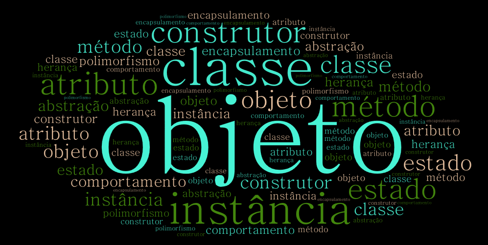

<!--
author:   Andrea Charão

email:    andrea@inf.ufsm.br

version:  0.0.1

language: PT-BR

narrator: Brazilian Portuguese Female

comment:  Material de apoio para a disciplina
          ELC117 - Paradigmas de Programação
          da Universidade Federal de Santa Maria

translation: English  translations/English.md

link:     https://cdn.jsdelivr.net/chartist.js/latest/chartist.min.css

script:   https://cdn.jsdelivr.net/chartist.js/latest/chartist.min.js
-->

<!--
nvm use v14.21.1
liascript-devserver --input README.md --port 3001 --live
https://liascript.github.io/course/?https://raw.githubusercontent.com/AndreaInfUFSM/elc117-2024b/master/classes/16/README.md
-->


[](https://liascript.github.io/course/?https://raw.githubusercontent.com/AndreaInfUFSM/elc117-2024b/main/classes/16/README.md)

# Programação Orientada a Objetos (1)


> Este material é parte de uma introdução ao paradigma de **programação orientada a objetos** em linguagem Java.


## Histórico e motivações


- Origens: linguagens Simula (1960s) e Smalltalk (1970s)
- Programação imperativa, evolução da programação procedimental estruturada 
- Conjunto de conceitos/recursos de programação para lidar com a complexidade crescente dos programas

  - Reuso de código: evitar redundância, aproveitar soluções já desenvolvidas
  - Organização do código: código organizado para melhor compreensão / manutenção

## Procedural X OO

Contraste entre programação procedural e programação orientada a objetos:

| Procedural      | Orientado a objetos  |
|-----------------|-----------------|
| código organizado em subprogramas (módulos, procedimentos, funções)   | código organizado para representar estado e comportamento de objetos |
| dados entram/saem dos subprogramas   | objetos interagem (um chama outro, um se relaciona com outro, etc.)   |


## Terminologia

- A programação orientada a objetos compreende uma vasta terminologia técnica
- Alguns termos para você ir se acostumando: classe, objeto, instância, construtor, atributo e método, estado e comportamento, abstração, encapsulamento, herança, polimorfismo



Criado com: http://wordart.com

## Linguagens

- Muitas linguagens relevantes atualmente possuem suporte a orientação a objetos
- Por exemplo: Java, C++, C#, Python, JavaScript, Swift, Kotlin, Dart, PHP, ...
- Veja alguns rankings de linguagens

  - TIOBE Index

    - Critério: search engines
    - https://www.tiobe.com/tiobe-index/

  - RedMonk

    - Critério: GitHub + StackOverflow 
    - https://redmonk.com/

  - Most Popular Programming Languages 1965 - 2022

    - Compilação de várias fontes em um gráfico animado
    - https://www.youtube.com/watch?v=qQXXI5QFUfw


## Java

- Linguagem criada em 1995 (Sun Microsystems, James Gosling)
- Implementação híbrida: compilador + interpretador (JVM)
- Multiparadigma, mas principalmente orientada a objetos
- Faz parte da família de linguagens derivadas do C
- Histórico de versões: https://en.wikipedia.org/wiki/Java_version_history


### Ambiente de desenvolvimento e execução

- Java Development Kit (JDK): compilador, interpretador e bibliotecas
- Java Runtime Environment (JRE): apenas para execução
- Várias implementações: Oracle, OpenJDK, Azul, etc.
- Gerenciadores de projetos/dependências: Maven, Gradle, etc.
- Em nuvem: Codespaces, Repl.it e muitos outros


### Exemplo clássico

> IDEs escondem compilação e execução em um único botão/atalho, mas entenda isso por partes!


 <details>
  <summary>Hello, World é um bom exemplo?</summary>
  <p>O clássico "Hello, World!" não é um bom exemplo de OOP, pois o paradigma se aplica melhor a programas maiores. Mesmo assim, vale o exemplo como programa mínimo em Java.</p>
</details> 


``` java  +HelloWorld.java
class HelloWorld {
  public static void main(String[] args) {
    System.out.println("Hello, World!"); 
  }
}
```

Compilar:

```
javac HelloWorld.java
```

Executar (JVM):

```
java HelloWorld
```


## Atividade de compreensão de código

Esta atividade será realizada em aula, seguindo orientações da professora, usando os seguintes códigos:

- [java01/StudentGrades.java](src/java01/StudentGrades.java)
- [java01/GenerateStudentData.java](src/java01/GenerateStudentData.java)


### StudentGrades.java


Em [java01/StudentGrades.java](src/java01/StudentGrades.java):

1. Identifique 3 (ou mais) **semelhanças** entre Java e C presentes no código.
2. Identifique 3 (ou mais) **diferenças** entre Java e C presentes no código.
3. O que fazem os comandos `javac StudentGrades.java` e `java StudentGrades`?
4. O que significa `students.size()`? Qual seu valor?
5. Como saber qual a nota retornada por `student.getGrade()`?
6. O que significa `students.add(student)`?
7. O que significa `new Student(name, id, grade)`?
8. O que significa `line.split(",")`?
9. O código manipula dados de estudantes da turma. Que dados caracterizam cada estudante?
10. Identifique um tipo de objeto definido no código.
11. Identifique a criação de um objeto no código.
12. Em Java, strings são objetos da classe String. Identifique no código algumas operações que podemos fazer com strings.
13. O que significa `private` em alguns pontos do código?
14. O que significa `public` em alguns pontos do código?
15. Substitua `student.getGrade()` por `student.grade`. Explique o que acontece na compilação do código.
16. Se trocarmos o nome da classe `StudentGrades` por `Main`, teremos erro de compilação. O que fazer para trocar o nome e não ter erro de compilação?

### GenerateStudentData.java

Em [java01/GenerateStudentData.java](src/java01/GenerateStudentData.java):

1. Identifique 3 (ou mais) **semelhanças** entre Java e C presentes no código.
2. Identifique 3 (ou mais) **diferenças** entre Java e C presentes no código.
3. O que fazem os comandos `javac GenerateStudentData.java` e `java GenerateStudentData`?
4. O que significa `Random random = new Random()`?
5. O que faz o código `random.nextDouble()`?
6. Encontre 2 linhas no código onde é feita a criação de algum objeto.
7. O que significa `try` dentro de `fetchJson`?
8. O que significa `new Student(name, id, grade)`?
9. Onde é especificada a quantidade de estudantes a serem gerados?
10. Em Java, strings são objetos da classe String. Identifique no código algumas operações que podemos fazer com strings.
11. O que significa `private` em alguns pontos do código?
12. O que significa `public` em alguns pontos do código?
13. Como este programa se comporta sem acesso à internet?


## Bibliografia


Robert Sebesta. Conceitos de Linguagens de Programação. Bookman, 2018. Disponível no Portal de E-books da UFSM: http://portal.ufsm.br/biblioteca/leitor/minhaBiblioteca.html (Capítulos 11 e 12)
