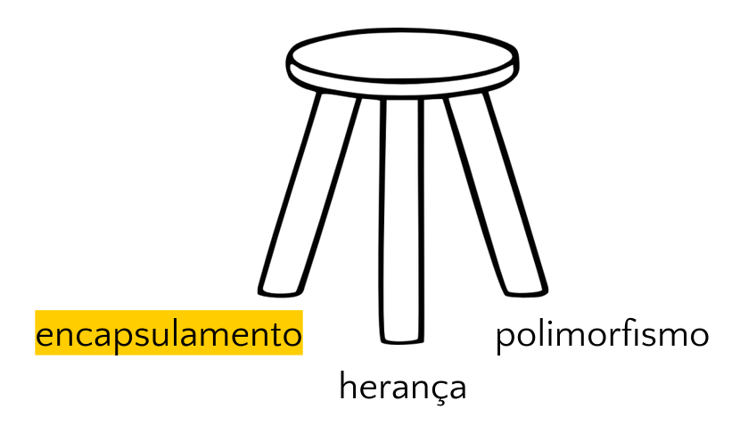

<!--
author:   Andrea Charão

email:    andrea@inf.ufsm.br

version:  0.0.1

language: PT-BR

narrator: Brazilian Portuguese Female

comment:  Material de apoio para a disciplina
          ELC117 - Paradigmas de Programação
          da Universidade Federal de Santa Maria

translation: English  translations/English.md

link:     https://cdn.jsdelivr.net/chartist.js/latest/chartist.min.css

script:   https://cdn.jsdelivr.net/chartist.js/latest/chartist.min.js


-->

<!--
nvm use v14.21.1
liascript-devserver --input README.md --port 3001 --live
https://liascript.github.io/course/?https://raw.githubusercontent.com/AndreaInfUFSM/elc117-2024b/master/classes/17/README.md
-->


[](https://liascript.github.io/course/?https://raw.githubusercontent.com/AndreaInfUFSM/elc117-2024b/main/classes/17/README.md)


# Programação Orientada a Objetos (2)


> Este material faz parte de uma introdução ao paradigma de **programação orientada a objetos** em linguagem Java.


## Conceitos da POO



A programação orientada a objetos se baseia em alguns conceitos (independentes de sintaxe) que favorecem organização, manutenção, compreensão e reuso de código. 

Conceitos básicos:

- Encapsulamento: https://en.wikipedia.org/wiki/Encapsulation_%28computer_programming%29

- Herança: https://en.wikipedia.org/wiki/Inheritance_%28object-oriented_programming%29

- Polimorfismo: https://en.wikipedia.org/wiki/Polymorphism_%28computer_science%29


## Encapsulamento

**Encapsulamento** é a junção de dados (variáveis/propriedades/atributos/estado) e operações (funções/métodos/comportamento) em uma mesma unidade, com proteção/limitação de acesso. 


Fonte: http://www.c-sharpcorner.com

Por quê?

- Organizar código de forma consistente (reunir dados e operações relacionados favorece manutenção, compreensão)
- Oferecer interface para (re)uso independente de detalhes internos (detalhes não são expostos desnecessariamente)

### Classe

- Recurso de linguagem que implementa um encapsulamento
- Geralmente representa a definição de um novo "tipo" 
- É um "molde" para criação de objetos (especifica o que é comum a todos objetos da classe)

Exemplo em Java:

``` java
class Circle {
  private double x; // atributo
  private double y; // atributo
  private double r; // atributo
  public double area() { // método
     return 3.1416 * r * r;
  }
}
```

Onde:

- `x`, `y`, `z` são atributos
- `area()` é um método 
- qualquer `Circle` criado terá seus próprios valores para os atributos `x,y,z`
- dado um `Circle` designado por `c` (ou outro nome qualquer), podemos obter sua área chamando `c.area()`

#### Exemplo: C versus Java

Tipo abstrado de dado (TAD) em C (possivelmente em arquivos diferentes):

``` c
typedef struct {
  double x;
  double y;
  double r;
} Circle;

double area(Circle *c) {
  return 3.1416 * c->r * c->r;
}
```

Classe em Java

``` java
class Circle {
  private double x;
  private double y;
  private double r;
  public double area() {
    return 3.1416 * r * r;
  }
}
```

### Objeto


- Um **objeto** é uma instância (um uso) de uma classe
- É criado/alocado em memória e referenciado por um nome


Exemplo em Java:

``` java
class TestCircle {
  public static void main(String[] args) {
    // declara a variável c como referência para um objeto da classe Circle
    Circle c;
    // cria objeto da classe Circle e guarda referência em c
    c = new Circle(); 
    // chama método area() do objeto referenciado por c
    System.out.println(c.area());
    // forma abreviada:
    // Circle c1 = new Circle(); 
  }
}
```

Onde:

- `c` é um nome de variável que referencia um objeto da classe `Circle`
- ou simplesmente: `c` é uma referência para um objeto `Circle` 
- `c` pode ser `null` - não referencia nenhum objeto
- criamos objetos com `new` (alocação de memória e inicializações)


#### Exemplo: C versus Java

Avance para ver diferenças/semelhanças em:

1. Definição do tipo `Circle`
2. Criação de um `Circle`
3. Uso de um `Circle`


#### Definição do tipo `Circle`


Em C (possivelmente em arquivos diferentes):

``` c
typedef struct {
  double x;
  double y;
  double r;
} Circle;

double area(Circle *c) {
  return 3.1416 * c->r * c->r;
}
```

Em Java: 

``` java
class Circle {
  private double x;
  private double y;
  private double r;
  public double area() {
    return 3.1416 * r * r;
  }
}
```


#### Criação de um `Circle`

Em C (dentro de `main`, por exemplo): : 

``` c
// c é ponteiro para Circle
Circle* c;

// memória alocada para Circle
c = (Circle*) malloc(sizeof(Circle));
```

Em Java (dentro de `main`, por exemplo): : 

``` java
// c é referência para
// objeto da classe Circle
Circle c;

// objeto criado com new
c = new Circle();
```


#### Uso de `Circle`

Em C (dentro de `main`, por exemplo): 

``` c
Circle c1;
area(&c1);

Circle* c2 = (Circle*) malloc(sizeof(Circle));
area(c2);

```

Em Java (dentro de `main`, por exemplo): 

``` java
Circle c = new Circle();

c.area();
```


### Construtores

Um **construtor** é um código que:

- inicializa um objeto
- é chamado na criação do objeto

#### Como? 

Sintaxe em Java:

- Mesmo nome da classe
- Sem tipo de retorno
- Podem existir vários construtores, diferenciados pelos tipos dos argumentos

Exemplo de classe com construtor:

``` java
class Circle {
  private double x, y, r;

  // construtor default, sem argumentos
  public Circle() {
    x = y = 0.0;
    r = 1.0;
  }

  public double area() {
    return 3.1416 * r * r;
  }
}
```

Construtor chamado na criação do objeto:


``` java
class TestCircle {
  public static void main(String[] args) {
    // construtor chamado aqui
    Circle c = new Circle(); 
    System.out.println(c.area());    
  }
}
```

#### Por quê?

Por que linguagens orientadas a objetos têm construtores?

- Inicializações são muito comuns, por isso merecem ser feitas de forma organizada/padronizada
- Evita que cada código "reinvente a roda" na inicialização de objetos (p.ex. com seus próprios nomes, ou em meio a outras operações)
- Tudo isso reforça motivações da POO: código organizado é mais fácil de modificar, compreender, reusar, etc.


### Referências para objetos

- São semelhantes a "ponteiros" em C
- Para usar objetos em Java, precisamos de referências não `null`, do contrário teremos `NullPointerException`
- No contexto interno da implementação de uma classe em Java, podemos usar `this` para nos referirmos ao próprio objeto (como em C# ou C++, mas diferente de Python que usa `self`)


``` java
class Circle {
  private double x;
  private double y;
  private double r;
  public Circle() {
    this.x = this.y = 0.0;
    this.r = 1.0;
    // Equivalente a:
    // x = y = 0.0;
    // r = 1.0;
    
  }
  public Circle(double x, double y, double r) {
    this.x = x;
    this.y = y;
    this.r = r;
    // Isto seria ambíguo:
    // x = x;
    // y = y;
    // r = r;    
  }
  public double area() {
     return 3.1416 * r * r;
  }
}
```

### Modificadores de acesso

São palavras-chave (por exemplo `private`, `public`, etc.) que especificam a visibilidade de atributos e métodos dentro/fora da classe (*).

| Visibilidade `private` | Visibilidade `public` |
|----------|----------|
| indica acesso permitido somente em código interno à própria classe   | indica acesso permitido fora da classe  |
| boas práticas: manter atributos privados   | boas práticas: métodos públicos para manipulação  |


Exemplo: Podemos acessar `r` livremente dentro da classe Circle

``` java
class Circle {
  private double x;
  private double y;
  private double r;
  public double area() {
     return 3.1416 * r * r;
  }
}
```

Exemplo: Fora da classe Circle, não podemos acessar `r`

``` java
class TestCircle {
  public static void main(String[] args) {
    Circle c = new Circle();    
    System.out.println(c.area());  // Ok, area() é public
    // c.r = 5; // error: r has private access in Circle
  }
}
```

#### Por quê?

Por que linguagens orientadas a objetos costumam ter modificadores de acesso em atributos/métodos(*)?

- Abstração: esconder detalhes quando não são necessários
- Proteção: reuso deve seguir regras para ser confiável/seguro
- Manutenção: alterações internas não exigem alteração nas classes usuárias


(*) Modificadores também podem se aplicar a uma classe inteira dentro de um pacote.

## Prática

### Circle no Codespaces

- Crie um repositório e um Codespace para as práticas de Java clicando aqui:

- Baixe estes arquivos e adicione-os ao seu Codespace:

  - [Circle.java](src/Circle.java)
  - [TestCircle.java](src/TestCircle.java)

- Para compilar:

  ```
  java *.java
  ```

- Para executar:

  ```
  javac TestCircle
  ```

  
### Crie sua classe

Pense nos aplicativos, sistemas, plataformas que você usa diariamente, por exemplo ao ouvir música, assistir vídeos, comunicar com amigos, reservar almoço no RU, etc. É provável que muitos desses exemplos sejam implementados com programação orientada a objetos! 

Nestes exemplos, você consegue identificar "objetos" de uma mesma "classe"? Que atributos caracterizam essa classe? (características que todos objetos da classe possuem, cada um com seu próprio valor). O que se pode fazer com objetos dessa classe? (métodos get/set, etc.).


Para responder a essas questões, você deverá criar uma classe em Java à sua escolha, considerando os seguintes requisitos:

1. A classe deve conter **atributos** de pelo menos 2 tipos diferentes (algumas possibilidades: `String, int, double, boolean`, etc.).

2. A classe deve conter mais de um **construtor**.

3. A classe deve conter **métodos** com prefixo `get` e `set`, respectivamente para obter e alterar cada atributo.

4. A classe deve conter um **método** que implemente alguma **operação** com um ou mais atributos (por exemplo, um teste de condição, um cálculo, uma operação com strings, etc.).

Coloque seu código em um arquivo .java com o mesmo nome da classe. Por exemplo, se a classe fosse `Circle`, o arquivo seria `Circle.java`. 

Compile seu código no Shell usando `javac`. Por exemplo:  `javac Circle.java`

> Atenção! Certifique-se de sempre compilar o código que for modificado. Na dúvida, delete os arquivos .class anteriores (no Shell: `rm *.class`). Mais adiante veremos como automatizar isso.

### Teste sua classe

Para testar sua classe, você vai criar um programa que:

1. Contenha uma classe com um método `main`, seguindo as convenções do Java (ver exemplos desta aula e da anterior). Nomeie esta classe com o prefixo `Test` seguido do nome da classe criada anteriormente (por exemplo, `TestCircle`).

2. Dentro do `main`, **instancie** pelo menos **2 objetos** da classe que você criou.

3. Para cada objeto criado, chame pelo menos **2 métodos** implementados.

Coloque seu código em arquivo .java com o prefixo `Test` seguido do nome da classe criada. Por exemplo, se a classe fosse `Circle`, o arquivo seria `TestCircle.java`.

Execute seu código no Shell usando a JVM (comando `java`). Por exemplo:  `java TestCircle` (lembre que o comando `java` recebe como argumento um nome de classe que contém o método `main`).


## Bibliografia


Robert Sebesta. Conceitos de Linguagens de Programação. Bookman, 2018. Disponível no Portal de E-books da UFSM: http://portal.ufsm.br/biblioteca/leitor/minhaBiblioteca.html (Capítulos 11 e 12)
