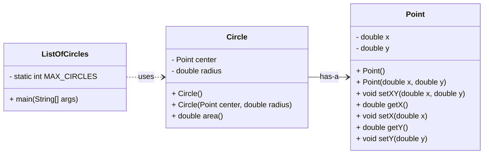
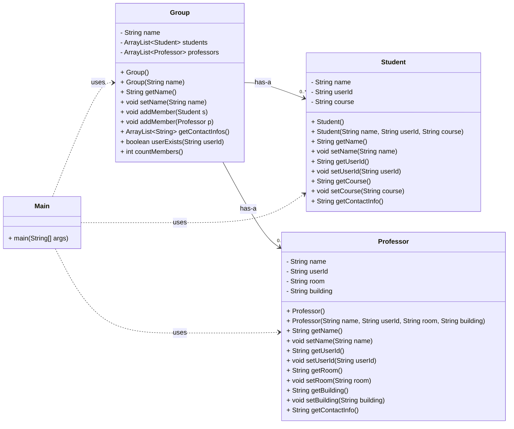

<!--
author:   Andrea Charão

email:    andrea@inf.ufsm.br

version:  0.0.1

language: PT-BR

narrator: Brazilian Portuguese Female

comment:  Material de apoio para a disciplina
          ELC117 - Paradigmas de Programação
          da Universidade Federal de Santa Maria

translation: English  translations/English.md

script:   https://cdn.jsdelivr.net/npm/mermaid@10.5.0/dist/mermaid.min.js


@onload
mermaid.initialize({ startOnLoad: false });
@end

@mermaid: @mermaid_(@uid,```@0```)

@mermaid_
<script run-once="true" modify="false" style="display:block; background: white">
async function draw () {
    const graphDefinition = `@1`;
    const { svg } = await mermaid.render('graphDiv_@0', graphDefinition);
    send.lia("HTML: "+svg);
    send.lia("LIA: stop")
};

draw()
"LIA: wait"
</script>
@end

@mermaid_eval: @mermaid_eval_(@uid)

@mermaid_eval_
<script>
async function draw () {
    const graphDefinition = `@input`;
    const { svg } = await mermaid.render('graphDiv_@0', graphDefinition);
    console.html(svg);
    send.lia("LIA: stop")
};

draw()
"LIA: wait"
</script>
@end


-->

<!--
nvm use v14.21.1
liascript-devserver --input README.md --port 3001 --live
https://liascript.github.io/course/?https://raw.githubusercontent.com/AndreaInfUFSM/elc117-2023b/master/classes/13/README.md
-->


[](https://liascript.github.io/course/?https://raw.githubusercontent.com/AndreaInfUFSM/elc117-2024b/main/classes/18/README.md)


# Programação Orientada a Objetos (3)


> Este material faz parte de uma introdução ao paradigma de **programação orientada a objetos** em linguagem Java.


Avance para preparar seu ambiente e ver o enunciado dos exercícios.

## Prepare seu ambiente Java

<h4>Qual Java Development Kit (JDK) usar?</h4>

- Opção 1: Use a distribuição do JDK do GitHub Codespaces. Você pode criar um Codespace clicando neste link: https://classroom.github.com/a/nQO8mWN3

- Opção 2: Instale uma distribuição localmente. Existem muitas distribuições e versões. É recomendável escolher alguma versão LTS (Long Term Support), como JDK 17 ou JDK 21.

  - Veja distribuições aqui: https://sdkman.io/jdks
  - Se estiver no Windows: https://learn.microsoft.com/en-us/java/openjdk/download
  - Se estiver em alguma distribuição Linux, use SDKMAN (que também pode ser usado no GitHub Codespaces):
  
    1. Instale SDKMAN pelo terminal: https://sdkman.io/install
    2. Use SDKMAN para installar a JDK: https://sdkman.io/usage


## Obtenha o código desta prática

Os arquivos desta prática estão no repositório da disciplina. Você pode obtê-los de mais de uma forma:

- Opção 1 (preferível): Clonar o repositório da disciplina (localmente ou no Codespace), com o seguinte comando no terminal:

  ```
  git clone https://github.com/andreaInfUFSM/elc117-2024b
  ```

- Opção 2: Baixar o repositório como um único arquivo .zip: https://github.com/AndreaInfUFSM/elc117-2024b/archive/refs/heads/main.zip


> ATENÇÃO: Os arquivos estão em sub-pastas na pasta `elc117-2024b/classes/18/src`


## Parte 1: Point, Circle e ListOfCircles

> Nesta parte, você vai apenas analisar e executar os códigos fornecidos, como base para as partes seguintes. 

Você vai trabalhar com arquivos na pasta `01-circles`. Os arquivos são os seguintes (conforme diagrama UML mais abaixo):

- [Point.java](src/01-circles/Point.java): contém uma classe que representa um ponto em um plano, com coordenadas X e Y
- [Circle.java](src/01-circles/Circle.java): contém uma classe que representa um círculo, definido por um ponto central e um raio
- [ListOfCircles.java](src/01-circles/ListOfCircles.java): contém classe com método `main` que cria vários objetos e os adiciona a uma lista

> ATENÇÃO: Os arquivos estão na pasta `elc117-2024b/classes/18/src/01-circles`





### Alguns comandos Linux

Se estiver usando o Codespaces, aproveite esta prática para exercitar alguns comandos Linux no terminal:


- Para entrar na pasta `elc117-2024b`: `cd elc117-2024b` (dica: use Tab para completar nomes de arquivos/pastas)

- Para ver conteúdo de uma pasta: `ls`

- Para voltar à pasta raiz da sua conta: `cd`

- Para saber em que pasta você está: `pwd`

- Para recuar a uma pasta imediatamente acima: `cd ..`

- Para remover todos os arquivos `.class` em uma pasta: `rm *.class`


### Analise os códigos

1. Compile e execute o código na pasta `01-circles` (depois de percorrer as pastas com `cd` até chegar na):
   ```
   cd 01-circles
   javac *.java
   java ListOfCircles
   ```
   Obs:. 

2. Analise as classes `Point` e `Circle`. Note que cada uma delas é uma classe bem simples, como as que vimos na aula anterior.

3. Analise a classe `ListOfCircles`, que contém novidades. Veja que esta classe usa a classe `ArrayList`, que representa uma estrutura de dados muito útil. Para usá-la, temos que primeiro criar um objeto da classe `ArrayList`, e depois usar métodos públicos desta classe para adicionar elementos ou fazer outras operações com a lista. 

4. Veja [aqui](https://www.w3schools.com/java/java_arraylist.asp) algumas operações possíveis de realizar com uma `ArrayList`. 


## Parte 2: ListOfTeamMates

> Esta parte deve ser realizada na pasta `02-teammates`.

Nesta parte, você vai criar um programa para armazenar informações sobre uma lista de colegas de equipe. 

Os dados a serem armazenados podem ser constantes ou gerados aleatoriamente (não devem ser digitados pelo usuário).

⚠️ Sempre que for definir nomes de classes, métodos, atributos, variáveis, etc., acostume-se a seguir alguma convenção de estilo, por exemplo
https://google.github.io/styleguide/javaguide.html#s5-naming. Veja [aqui](https://vaiprogramar.com/nomes-de-variaveis-tudo-que-voce-precisa-saber-para-programar/) um artigo sobre a importância disso.


### Class TeamMate

Na pasta `02-teammates`, no arquivo `TeamMate.java`:

1. Crie a classe `TeamMate` com os seguintes atributos representando um colega:
   - userId: String
   - name: String
   - online: boolean 

2. Crie métodos get/set para todos os atributos.

3. Crie um construtor default (que não recebe argumentos). Você pode escolher quais serão os valores default para cada atributo.

4. Crie um construtor que receba 3 argumentos e os utilize para inicializar os 3 atributos.

5. Crie um construtor que receba valores para `userId` e `name` e inicialize os 2 atributos correspondentes. Este construtor deverá inicializar o atributo `online` com o valor default `false`.

### Classe ListOfTeamMates

Na pasta `02-teammates`, no arquivo `ListOfTeamMates.java`:

1. Crie a classe `ListOfTeamMates` que deverá ter um método `main`.  Siga exatamente a sintaxe usada nos outros exemplos que definem este método: `public static void main(String[] args)`.

2. Dentro do método `main`, crie um objeto da classe `ArrayList<TeamMate>` para representar uma lista de colegas de equipe.

3. Crie vários objetos da classe `TeamMate`, usando qualquer lógica à sua escolha para setar os atributos de cada `TeamMate`. Adicione todos os objetos na lista.

4. Percorra a lista e mostre o nome de cada `TeamMate` armazenado.

5. Percorra a lista e mostre o `userId` dos `TeamMate` que estiverem `online`.

6. Consulte [aqui](https://www.w3schools.com/java/java_arraylist.asp) outros métodos disponíveis na classe `ArrayList` e utilize algum que não tenha sido usado antes.


## Parte 3: Groups

> Nesta parte, você vai completar um código fornecido.


Você vai trabalhar com arquivos na pasta `03-groups`. Os arquivos são os seguintes:


- `Student.java`: classe que representa um estudante de uma instituição
- `Professor.java`: classe que representa um professor de uma instituição
- `Group.java`: classe que representa um grupo de pesquisa da instituição. Um grupo pode ter estudantes e professores como membros. **Esta classe está incompleta!**
- `Main.java`: classe contendo um método `main` que cria e manipula objetos das classes acima




### Completando o código

1. Compile e execute o código:

   ```
   cd 03-groups
   javac *.java
   java Main
   ```
   **Você verá que a compilação dá erro, pois o código está incompleto!**


2. Você deverá fazer o código funcionar alterando somente o arquivo `Group.java`, de forma a completar as partes marcadas com "COMPLETE-ME". Para isso, é importante analisar todos os arquivos fornecidos.

4. Se o código for completado como solicitado, a saída do Main será a seguinte:

   ```
   NCC has 3 members
   [{class='Student', name='Nome1 Sobrenome1', userId='username1'}, {class='Student', name='Nome2 Sobrenome2', userId='username2'}, {class='Professor', name='Andrea Charao', userId='andrea', room='376', building='Anexo B'}]
   User andrea found
   ```


### Refletindo sobre o código

O código fornecido não usa todo o potencial da orientação a objetos. Vamos fazer uma análise crítica deste código.

1. Você consegue identificar alguma redundância nos códigos (dentro de uma mesma classe ou em classes diferentes)?

2. O que aconteceria se fosse necessário armazenar outros atributos sobre estudantes e professores? (por exemplo, CPF, data de nascimento, telefone, etc?)

3. O que aconteceria na classe `Group` se tivéssemos outras categorias de membros além de estudantes e professores (técnicos, administradores, etc.)?


## Bibliografia


Robert Sebesta. Conceitos de Linguagens de Programação. Bookman, 2018. Disponível no Portal de E-books da UFSM: http://portal.ufsm.br/biblioteca/leitor/minhaBiblioteca.html (Capítulos 11 e 12)
