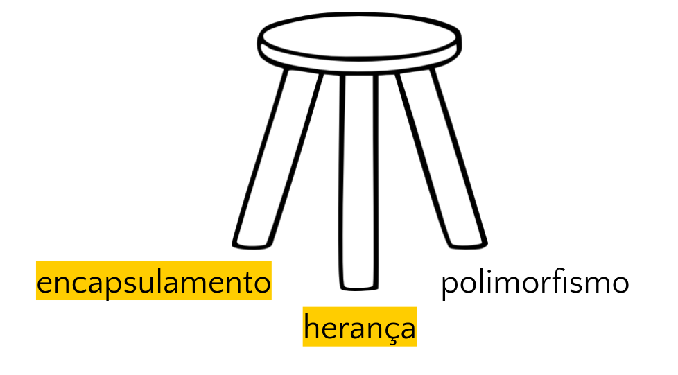
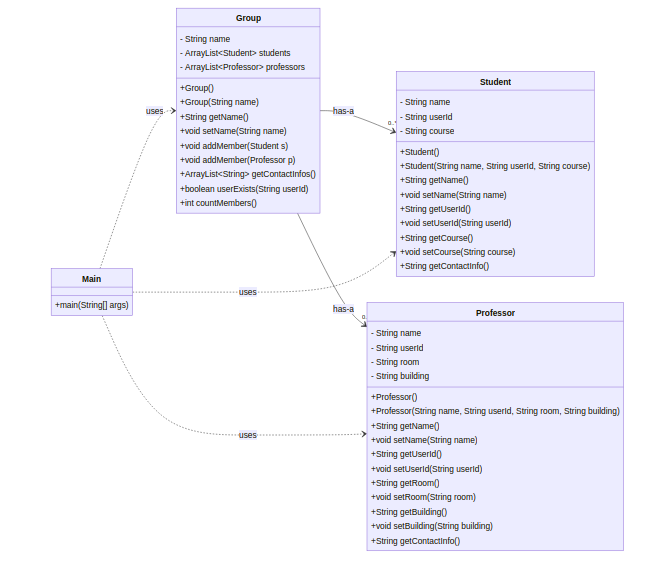
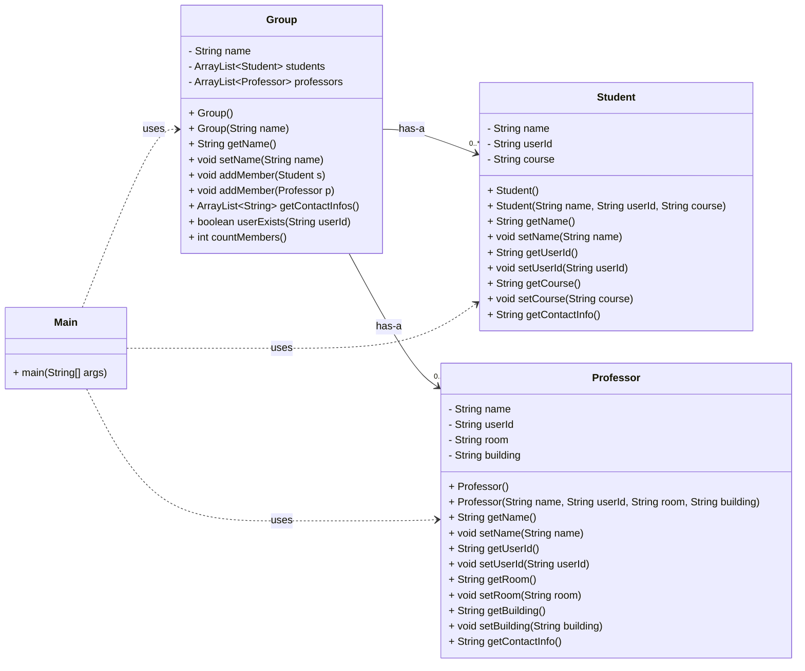
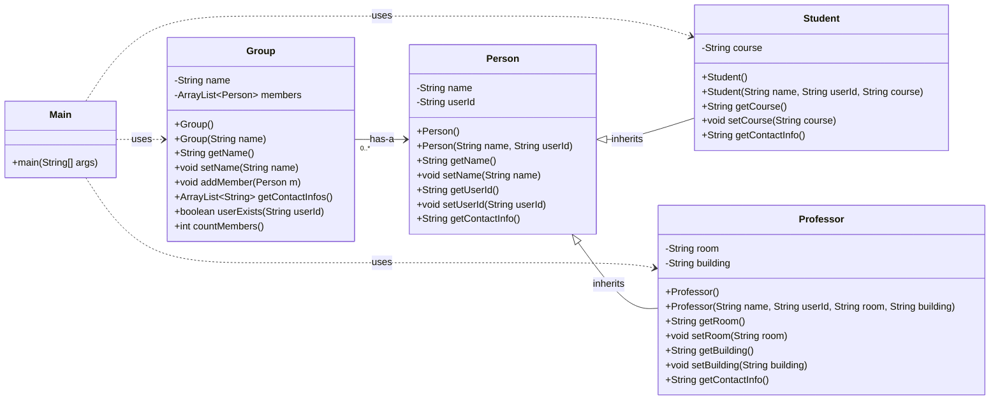

<!--
author:   Andrea Charão

email:    andrea@inf.ufsm.br

version:  0.0.1

language: PT-BR

narrator: Brazilian Portuguese Female

comment:  Material de apoio para a disciplina
          ELC117 - Paradigmas de Programação
          da Universidade Federal de Santa Maria

translation: English  translations/English.md

script:   https://cdn.jsdelivr.net/npm/mermaid@10.5.0/dist/mermaid.min.js


@onload
mermaid.initialize({ startOnLoad: false });
@end

@mermaid: @mermaid_(@uid,```@0```)

@mermaid_
<script run-once="true" modify="false" style="display:block; background: white">
async function draw () {
    const graphDefinition = `@1`;
    const { svg } = await mermaid.render('graphDiv_@0', graphDefinition);
    send.lia("HTML: "+svg);
    send.lia("LIA: stop")
};

draw()
"LIA: wait"
</script>
@end

@mermaid_eval: @mermaid_eval_(@uid)

@mermaid_eval_
<script>
async function draw () {
    const graphDefinition = `@input`;
    const { svg } = await mermaid.render('graphDiv_@0', graphDefinition);
    console.html(svg);
    send.lia("LIA: stop")
};

draw()
"LIA: wait"
</script>
@end

-->

<!--
nvm use v14.21.1
liascript-devserver --input README.md --port 3001 --live
https://liascript.github.io/course/?https://raw.githubusercontent.com/AndreaInfUFSM/elc117-2023b/master/classes/19/README.md
-->


[](https://liascript.github.io/course/?https://raw.githubusercontent.com/AndreaInfUFSM/elc117-2024b/main/classes/19/README.md)

# Programação Orientada a Objetos (4)


> Este material faz parte de uma introdução ao paradigma de **programação orientada a objetos** em linguagem Java.


## Conceitos da POO




A programação orientada a objetos se baseia em alguns conceitos (independentes de sintaxe) que favorecem organização, manutenção, compreensão e reuso de código. 

Conceitos básicos:

- [ ] Encapsulamento: https://en.wikipedia.org/wiki/Encapsulation_%28computer_programming%29

- [ ] Herança: https://en.wikipedia.org/wiki/Inheritance_%28object-oriented_programming%29

- [ ] Polimorfismo: https://en.wikipedia.org/wiki/Polymorphism_%28computer_science%29


## Quizzes

As 10 questões abaixo têm correção automática:


                 {{1}}
************************************************

Os atributos e métodos de um objeto representam, respectivamente... 

[( )] seu comportamento e seu estado
[(x)] seu estado e seu comportamento

************************************************

                 {{2}}
************************************************

Em um sistema de e-commerce em Java, há uma classe 'Product' que contém uma String chamada 'sku' para representar o código de um produto e um float 'price' para representar o preço do produto.

Uma variável 'prod' é declarada como sendo da classe 'Product'. Qual das seguintes afirmações está correta?

[( )] sku e price são instâncias de Product
[( )] Product é uma instância de prod
[(x)] prod terá seu próprio valor de price
[( )] prod é um atributo de Product


************************************************

                 {{3}}
************************************************

Qual das opções abaixo é um construtor válido para uma classe 'Person'?


[( )] `public void Person() { }`
[(x)] `public Person(String name) { }`
[( )] `public initPerson() {}`
[( )] `void constructPerson() { }`


************************************************

                 {{4}}
************************************************

Verdadeiro ou falso? "Um método público pode acessar somente atributos públicos declarados na classe a que ele pertence."

[( )] Verdadeiro
[(x)] Falso


************************************************

                 {{5}}
************************************************

As declarações de métodos abaixo são válidas dentro de uma classe Person?

``` java
public void method(int a) { }

public void method(float b) { }
```

[(x)] Sim
[( )] Não


************************************************


                 {{6}}
************************************************

As declarações de métodos abaixo são válidas dentro de uma classe Person?

``` java
public int method(int a) { }

public void method(int a) { }
```

[( )] Sim
[(x)] Não


************************************************

                 {{7}}
************************************************

Considerando o código abaixo, qual das opções é válida para criar uma instância de Person?


``` java
public class Person {
  private String name;
  private int age;
  public Person(String n, int a) {
    name = n;
    age = a;
  }
}
```

[(x)] Person p = new Person("Maria", 18);
[( )] Object p = new Person("Maria", "18");
[( )] Person p = new Person();
[( )] Object p = new Person();
***********************************************************************
Em Java, se não for definido nenhum construtor em uma classe, o compilador automaticamente fornece um construtor padrão sem argumentos. Esse construtor padrão é essencialmente um construtor vazio.
No entanto, se for definido qualquer construtor com parâmetros na classe, o Java não fornecerá mais automaticamente um construtor sem argumentos. Nesse caso, caso ainda seja necessário um construtor sem argumentos, será necessário defini-lo explicitamente.
***********************************************************************

************************************************

                 {{8}}
************************************************

Quantos atributos estão declarados na classe Person? 

``` java
public class Person {
  private String name;
  private int age;
  public Person(String n, int a) {
    name = n;
    age = a;
  }
}
```

[[2]]

************************************************


                 {{9}}
************************************************

O código `Person p;` cria um objeto da classe Person em Java?


[( )] Sim
[(x)] Não


************************************************

                 {{10}}
************************************************

Para descontrair :-) Java é uma linguagem que suporta o paradigma de programação... 

[( )] orientado a dificuldades
[( )] orientado a gambiarras
[(x)] orientado a objetos
[( )] orientado a games

************************************************


## Diagramas de classe (UML)

<div style="display: flex; flex-direction: column; gap: 20px;">
  <div style="display: flex; align-items: center; width: 100%; margin-bottom: 20px;">
    
    <div style="margin-left: 15px;">
      <blockquote class="lia-quote">Programas orientados a objetos são organizados em muitas classes que <b>se relacionam</b> umas com as outras</blockquote>
      
    </div>
  </div>


  <!-- Add more items here -->
</div>


- Modelagem de software com UML (Unified Modeling Language): intersecção com engenharia de software

  - na Wikipedia: https://en.wikipedia.org/wiki/Unified_Modeling_Language
  - especificação oficial: https://www.omg.org/spec/UML/

- Diagramas de classe descrevem a estrutura de um software graficamente

  - classes representadas por retângulos compartimentados, separando nome da classe, atributos, métodos
  - relações entre classes representadas por linhas/flechas interligando as classes
  - na Wikipedia: https://en.wikipedia.org/wiki/Class_diagram


### Diagrama da aula passada





### Relações entre classes

Podem ser: dependência, associação, agregação, composição, herança, realização/implementação

- Dependência: uma classe usa objeto de outra classe (mudanças na segunda podem afetar a primeira)
- Associação: atributo de uma classe referencia uma instância (ou instâncias) de outra classe
- Agregação: tipo de associação entre "um todo" e uma parte, que pode existir independentemente
- Composição: tipo de associação entre "um todo" e uma parte, sendo que a parte não pode existir independentemente


Mais sobre isso em: 

- Visual Paradigm: uma ferramenta clássica de modelagem de software
- https://blog.visual-paradigm.com/what-are-the-six-types-of-relationships-in-uml-class-diagrams/#Association_Relationships


## Herança

- Outro tipo de relação entre classes 
- Inspirada no "mundo real": pais transmitem aos filhos suas características e comportamento
- Motivação: evitar **redundâncias** - mais produtividade, mais facilidade de manutenção
- Menos frequente que dependência/associação/agregação em programas "pequenos", mas muito usado em frameworks


### Problema: Student, Professor, Group

Problema:

- Classes Student e Professor têm alguns atributos idênticos (**redundância**): name, userId
- Classe Group tem código redundante: 2 ArrayList, métodos com código **redundante** (mesmo algoritmo aplicado a Student e Professor)

Student.java

``` java
public class Student {
  private String name;
  private String userId;
  private String course;

  // ...
}
```

Professor.java

``` java
public class Professor {
  private String name;
  private String userId;
  private String room;
  private String building;

  // ...
}
```

Group.java

``` java
public class Group {
  private String name;
  private ArrayList<Student> students;
  private ArrayList<Professor> professors;

  // ...

  public void addMember(Student s) {
    this.students.add(s);
  }

  public void addMember(Professor p) {
    this.professors.add(p);
  }
  
  public ArrayList<String> getContactInfos() {
    ArrayList<String> contact = new ArrayList<String>();
    for (Student s: students) {
      contact.add(s.getContactInfo());
    }
    for (Professor p: professors) {
      contact.add(p.getContactInfo());
    }
    return contact;
  }  

}
```

### Solução do problema

Eliminar redundância com herança:

1. Criar uma classe Person com atributos/métodos comuns a Student e Professor
2. Criar Student e Professor como classes derivadas (que herdam atributos/métodos) de Person 
3. Em Group, substituir ArrayList<Student> e ArrayList<Professor> por ArrayList<Person>


### Em Java: `extends`

Nova classe `Person` (super-classe, classe mãe):

- é uma classe como outra qualquer que vimos até agora

``` java
class Person {
  private String name;
  public Person() {
    this.name = "to be given";
  }
  public String getName() {
    return this.name;
  }
}
```


Classe `Student` derivada de `Person`:

- usa `extends` em sua definição para indicar que herda atributos/métodos de outra classe
- outras linguagens de OOP suportam o mesmo conceito mas variam a sintaxe e particularidades

``` java
class Student extends Person {
  private String course;
  public Student() {
    this.course = "to be chosen";
  }
}
```

### Em UML

Diagrama de uma solução para a prática da aula passada:

> Agora só temos `ArrayList<Person>` em Group!





Anterior:


### Herança implica em...

> Fim do copy/paste de código entre classes! :-)

- objeto da classe Student terá **atributo herdado** de Person: name 
- objeto da classe Student terá **método herdado** de Person: getName()
- fica implícito que classes usuárias de `Student` podem chamar `getName()`


``` java
class Person {
  private String name;
  public Person() {
    this.name = "to be given";
  }
  public String getName() {
    return this.name;
  }
}

class Student extends Person {
  private String course;
  public Student() {
    this.course = "to be chosen";
  }
}

class Main {
 public static void main(String[] args) {
   Person p = new Person();
   Student s = new Student();
   System.out.println(p.getName());
   System.out.println(s.getName()); // herança em ação!
 }
}
```

### Construtores 

> Construtor de classe-mãe é chamado implicitamente **ANTES** do construtor da filha!


``` java
class Person {
  private String name;
  public Person() {
    System.out.println("Construtor de Person");
  }
  public String getName() {
    return this.name;
  }
}

class Student extends Person {
  private String course;
  public Student() {
    System.out.println("Construtor de Student");
  }
}

class Main {
  public static void main(String[] args) {
    // chama construtor de Person e depois de Student
    Student s = new Student();
  }
}
```

### Encapsulamento

> Atributos e métodos **privados** da classe-mãe **não podem** ser acessados na classe-filha

``` java
class Student extends Person {
  private String course;
  public Student() {
    System.out.println("Construtor de Student");
    this.course = "CC";
    this.name = ""; // erro: name is private
  }
}
```

### Visibilidade `protected`

> Torna atributos e métodos visíveis a classes derivadas (mas não a outras classes "fora da família")

``` java
class Person {
  protected String name; // agora é protected!
  public Person() {
    System.out.println("Construtor de Person");
  }
  public String getName() {
    return this.name;
  }
}

class Student extends Person {
  private String course;
  public Student() {
    System.out.println("Construtor de Student");
    this.course = "CC";
    this.name = ""; // OK agora!
  }
}
```

### Herança: relação "is-a"

Herança também implica em: 

- Student "is-a" Person (todo estudante é uma pessoa)
- Logo, objeto Student pode ser usado onde se espera Person
- Contrário não se aplica: nem toda pessoa é estudante

> Objeto da classe derivada pode ser usado onde se manipula super-classe

``` java
class Main {
  public static void main(String[] args) {
    Person p = new Person();
    Student s = new Student();
    ArrayList<Person> lis = new ArrayList<Person>();
    lis.add(p);
    lis.add(s);
  }
}
```

### "is-a" X "has-a"

Lembre-se que classes podem se relacionar de diferentes maneiras

| "is-a" (é-um)   | "has-a" (tem-um)   |
| :--------- | :--------- |
| herança (generalização/especialização)     | agregação/composição     |
| `class Student extends Person { }` | `class Person { String name; }` | 
| Student is a Person | Person has a name | 


### Quiz: quando usar herança?

- Lembre alguns objetivos da OOP: código organizado, mais fácil de ler e modificar
- Herança evita redundâncias: código repetitivo com algumas substituições
- Muitas bibliotecas/frameworks costumam exigir que você crie suas classes derivadas de outras existentes
- Quando estiver criando sua hierarquia de classes, aplique o teste "is-a"


Faça o teste:

  - [[x]] class Piano extends Instrumento
  - [[ ]] class Lista extends Elemento
  - [[ ]] class Pessoa extends Administrador
  - [[x]] class Cerveja extends Bebida
  - [[ ]] class Ferrari extends Motor
  - [[ ]] class Bebida extends Vinho
  - [[x]] class Prata extends Metal
  - [[ ]] class Button extends Window
  - [[x]] class Felino extends Animal
  - [[ ]] class Vehicle extends Bus


## Herança no "mundo real"!

Avance para ver alguns links que ilustram herança em códigos do "mundo real" 

### Em documentação

- Hierarquia de classes do pacote `javax.swing` para criação de interfaces gráficas para desktop: 

  https://docs.oracle.com/en/java/javase/21/docs/api/java.desktop/javax/swing/package-tree.html

- Hierarquia de classes do framework Spring Boot para aplicações web (backend): 

  https://docs.spring.io/spring-boot/docs/current/api/overview-tree.html

O que há em comum?

> Em Java, todas as classes derivam implicitamente da classe `Object` !

### Em games de Paradigmas

Guillotine Clicker

- https://pinhalgrandense.itch.io/guillotineclicker
- https://github.com/elc117/t4-2022a-flavio_gregori_matheus
- https://github.com/elc117/t4-2022a-flavio_gregori_matheus/blob/main/core/src/com/mygdx/game/GuillotineClicker.java

Jonas vs Arcana Invaders

- https://guglis.itch.io/jonas-vs-arcana-invaders
- https://github.com/elc117/Jonas-Vs-Arcana-Invaders
- https://github.com/elc117/Jonas-Vs-Arcana-Invaders/blob/main/core/src/com/uga/game/JonasVsArcanaInvaders.java


UFSM Rock Star

- https://henrique-krever.itch.io/ufsm-rockstar
- https://github.com/elc117/2021gamet4-nos-temos-o-nata
- https://github.com/elc117/2021gamet4-nos-temos-o-nata/blob/main/core/src/com/ufsm/rockstar/UfsmRockstar.java

Syrene

- https://alegz.itch.io/syrene
- https://github.com/elc117/game-Alexandre-ChagasBrites
- https://github.com/elc117/game-Alexandre-ChagasBrites/blob/master/core/src/com/alegz/mermaid/physics/BoxCollider.java
- https://github.com/elc117/game-Alexandre-ChagasBrites/blob/master/core/src/com/alegz/mermaid/physics/CircleCollider.java


Encontre mais jogos em:

- https://itch.io/jam/games-paradigmas-programacao-ufsm-2020a
- https://itch.io/jam/games-paradigmas-programacao-ufsm-2021a
- https://itch.io/jam/games-paradigmas-programacao-ufsm-2022a


## Prática


### Parte 1: Herança em Assignments

Sua empresa está desenvolvendo um software assistente na organização de tarefas (assignments) de disciplinas de faculdade. Uma das funcionalidades do software é a geração de mensagens de notificação sobre cada tarefa. As tarefas podem ser individuais ou em grupo, e tarefas em grupo têm dados adicionais. Você vai colaborar no desenvolvimento de algumas classes para resolver este problema.


1. Você vai trabalhar com arquivos na pasta `01-assignments`. Os arquivos são os seguintes:

   - [Assignment.java](src/01-assignments/Assignment.java):  classe que representa uma tarefa
   - [GroupAssignment.java](src/01-assignments/GroupAssignment.java): classe que representa uma tarefa a ser desenvolvida em grupo
   - [TrackAssignments](src/01-assignments/TrackAssignments.java): classe que contém o método main, que cria e manipula uma lista de tarefas


2. Compile e execute o código fornecido, usando comandos vistos nas práticas anteriores. Você verá mensagens indicando que o código tem que ser completado.


3. Na classe `Assignment`, implemente o método `public String toString()`, de forma que o primeiro laço em `TrackAssignments` produza o seguinte:

   ```
   ==> Printing all assignment **OBJECTS**:
   { dueDate='2024-11-28', description='game', pending='true', submitDate='null'}
   { dueDate='2024-11-01', description='java01', pending='true', submitDate='null'}
   { dueDate='2024-11-02', description='java02', pending='true', submitDate='null'}
   { dueDate='2024-11-03', description='java03', pending='true', submitDate='null'}
   ```
   Veja mais sobre o método `toString`:

   - em português [aqui](http://www.mauda.com.br/?p=1472) (em português) ou 
   - em inglês [aqui](https://runestone.academy/ns/books/published/csawesome/Unit9-Inheritance/topic-9-7-Object.html)

4. Na classe `Assignment`, complete o método `status`  para retornar uma String que represente a situação da tarefa:

   - "done" se a tarefa estiver completa (não pendente)
   - "late" se a tarefa estiver pendente e atrasada
   - "due in x days" se a tarefa estiver pendente, faltando x=daysLeft() dias para a entrega

5. Na classe `GroupAssignment`, note que o construtor usa a palavra-chave `super`. Veja mais sobre isso:

   - Uso de `super` em construtores: https://materialpublic.imd.ufrn.br/curso/disciplina/2/8/8/4
   - Outra forma de usar `super`: https://www.w3schools.com/java/ref_keyword_super.asp
   - Leia este material acima, pois vai ser útil na questão seguinte!

6. Na classe `GroupAssignment`, complete o método `notificationMessage()` para retornar uma mensagem modificada quando a tarefa for em grupo, conforme o exemplo abaixo:

   ```
   ==> Printing all assignment **MESSAGES**:
   Group Assignment game is due in 18 days - call teamMate1, teamMate2
   Assignment java01 is late
   Group Assignment java02 is late - call teamMate1
   Group Assignment java03 is due in 4 days - call teamMate1
   ```
   Dicas:

   - Identifique um "padrão" nas mensagens de notificação: o que é variável e o que é constante na mensagem modificada?
   - Para evitar redundância, use `super` para aproveitar/reusar a mensagem implementada na superclasse


7. Na classe `TrackAssignments`, no final do método `main`, adicione um código para contar e mostrar a quantidade de tarefas concluídas (não pendentes).


8. Se você completou tudo corretamente, o resultado da execução do código agora terá esta forma (com algumas diferenças dependendo da data em que você executar):

   ```
   ==> Printing all assignment **OBJECTS**:
   { dueDate='2024-11-28', description='game', pending='true', submitDate='null'}
   { dueDate='2024-11-01', description='java01', pending='true', submitDate='null'}
   { dueDate='2024-11-02', description='java02', pending='true', submitDate='null'}
   { dueDate='2024-11-14', description='java03', pending='true', submitDate='null'}

   ==> Printing all assignment **MESSAGES**:
   Group Assignment game is due in 18 days - call teamMate1, teamMate2
   Assignment java01 is late
   Group Assignment java02 is late - call teamMate1
   Group Assignment java03 is due in 4 days - call teamMate1

   ==> Printing all assignment messages **AGAIN**:
   Assignment game is done
   Assignment java01 is late
   Group Assignment java02 is late - call teamMate1
   Group Assignment java03 is due in 4 days - call teamMate1

   ==> Completed assignments: 1

   ```


### Parte 2: Herança em Quizzes


Nesta parte, você vai criar um programa "do zero", escrevendo todo o código. O programa deverá ter uma hierarquia de classes representando diferentes tipos de questões de quizzes, uma classe representando um quiz e um programa principal que irá criar e fazer algumas operações com um quiz.

1. Crie uma superclasse `Question`, com atributos/métodos comuns a qualquer tipo de quiz (você tem liberdade para defini-los - não há uma única forma correta de representar isso).

2. Crie pelo menos 2 classes derivadas de `Question`, representando outros tipos de questões, por exemplo: verdadeiro/falso, múltipla-escolha, preencher lacunas, etc. Estas classes especializadas deverão ter atributos específicos.

3. Crie uma classe `Quiz`, que deverá armazenar e gerenciar uma lista de questões, como no exemplo com herança na classe `Group` da aula anterior. 

4. Crie uma classe `Main`, que deverá criar um quiz com várias questões de diferentes classes. Depois de criá-lo, você deverá fazer pelo menos 2 operações à sua escolha  (por exemplo, mostrar as questões, verificar resposta de uma questão, sortear uma questão, etc.), de acordo com os métodos que você implementou na classe `Quiz`.


## Bibliografia


Robert Sebesta. Conceitos de Linguagens de Programação. Bookman, 2018. Disponível no Portal de E-books da UFSM: http://portal.ufsm.br/biblioteca/leitor/minhaBiblioteca.html (Capítulos 11 e 12)
