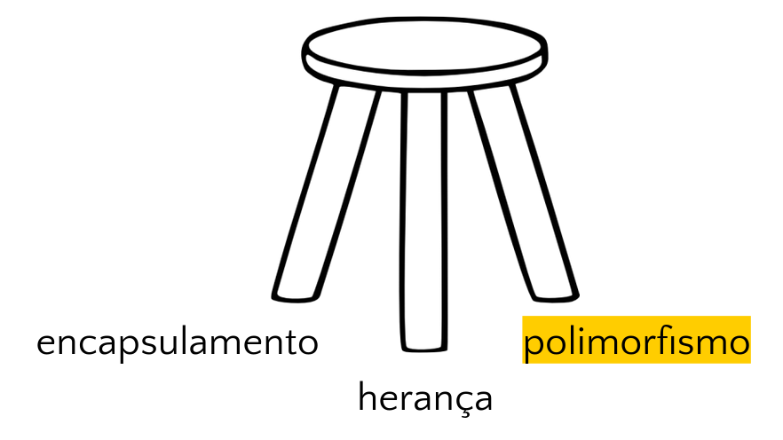
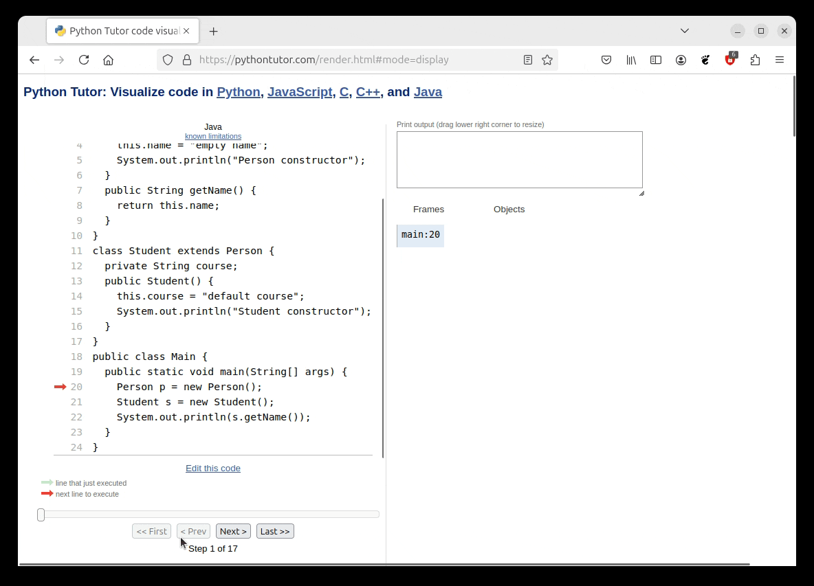

<!--
author:   Andrea Charão

email:    andrea@inf.ufsm.br

version:  0.0.1

language: PT-BR

narrator: Brazilian Portuguese Female

comment:  Material de apoio para a disciplina
          ELC117 - Paradigmas de Programação
          da Universidade Federal de Santa Maria

translation: English  translations/English.md

@load.java: @load(java,@0)

@load
<script style="display: block" modify="false" run-once="true">
    fetch("@1")
    .then((response) => {
        if (response.ok) {
            response.text()
            .then((text) => {
                send.lia("LIASCRIPT:\n``` @0\n" + text + "\n```")
            })
        } else {
            send.lia("HTML: <span style='color: red'>Something went wrong, could not load <a href='@1'>@1</a></span>")
        }
    })
    "loading: @1"
</script>
@end
-->

<!--
nvm use v14.21.1
liascript-devserver --input README.md --port 3001 --live
https://liascript.github.io/course/?https://raw.githubusercontent.com/AndreaInfUFSM/elc117-2023b/master/classes/20/README.md
-->

[](https://liascript.github.io/course/?https://raw.githubusercontent.com/AndreaInfUFSM/elc117-2024b/main/classes/20/README.md)


# Programação Orientada a Objetos (5)


> Este material faz parte de uma introdução ao paradigma de **programação orientada a objetos** em linguagem Java.


## Conceitos da POO




**Relembrando:** A programação orientada a objetos se baseia em alguns conceitos (independentes de sintaxe) que favorecem organização, manutenção, compreensão e reuso de código. 

Conceitos básicos:

- [ ] Encapsulamento: https://en.wikipedia.org/wiki/Encapsulation_%28computer_programming%29

- [ ] Herança: https://en.wikipedia.org/wiki/Inheritance_%28object-oriented_programming%29

- [ ] Polimorfismo: https://en.wikipedia.org/wiki/Polymorphism_%28(computer_science%29


## Relembrando: herança

- Classes derivadas (declaradas com `extends`)

  - herdam (reusam!) atributos e métodos de classes existentes

- Construtor da superclasse 

  - é chamado antes do construtor da classe derivada

- Visibilidade `protected`

  - torna atributos/métodos acessíveis a classe derivada


### Resumo de visibilidade

| Acesso     | private   | protected   | public   | default   |
| :--------- | :--------- | :--------- | :--------- | :--------- |
| mesma classe                        | sim    | sim     | sim     | sim     |
| classe derivada (mesmo pacote)      | não    | sim     | sim     | sim     |
| classe não derivada (mesmo pacote)  | não    | sim     | sim     | sim     |
| classe derivada (outro pacote)      | não    | sim     | sim     | não     |
| classe não derivada (outro pacote)  | não    | não     | sim     | não     |


### Exemplo básico

Observações importantes:

1. `Student` deriva de `Person` (estudante é uma pessoa)
2. método público `getName` de `Person` é herdado por `Student`
3. `getName` continua público em `Student` e pode ser chamado por classes usuárias
4. `new` provoca chamada de construtores


``` java
class Person {
  private String name;
  public Person() {    
    this.name = "empty name";
    System.out.println("Person constructor");
  }
  public String getName() {
    return this.name;
  }
}
class Student extends Person {
  private String course;
  public Student() {    
    this.course = "default course";
    System.out.println("Student constructor");
  }
}
public class Main {
  public static void main(String[] args) {
    Person p = new Person();
    Student s = new Student();
    System.out.println(s.getName());
  }
}
```

### Execução passo-a-passo

Python Tutor: Online Compiler, Visual Debugger, and AI Tutor for Python, Java, C, C++, and JavaScript 

Execute o código passo-a-passo neste [link](https://pythontutor.com/visualize.html#code=class%20Person%20%7B%0A%20%20private%20String%20name%3B%0A%20%20public%20Person%28%29%20%7B%20%20%20%20%0A%20%20%20%20this.name%20%3D%20%22empty%20name%22%3B%0A%20%20%20%20System.out.println%28%22Person%20constructor%22%29%3B%0A%20%20%7D%0A%20%20public%20String%20getName%28%29%20%7B%0A%20%20%20%20return%20this.name%3B%0A%20%20%7D%0A%7D%0Aclass%20Student%20extends%20Person%20%7B%0A%20%20private%20String%20course%3B%0A%20%20public%20Student%28%29%20%7B%20%20%20%20%0A%20%20%20%20this.course%20%3D%20%22default%20course%22%3B%0A%20%20%20%20System.out.println%28%22Student%20constructor%22%29%3B%0A%20%20%7D%0A%7D%0Apublic%20class%20Main%20%7B%0A%20%20public%20static%20void%20main%28String%5B%5D%20args%29%20%7B%0A%20%20%20%20Person%20p%20%3D%20new%20Person%28%29%3B%0A%20%20%20%20Student%20s%20%3D%20new%20Student%28%29%3B%0A%20%20%20%20System.out.println%28s.getName%28%29%29%3B%0A%20%20%7D%0A%7D&cumulative=false&heapPrimitives=true&mode=edit&origin=opt-frontend.js&py=java&rawInputLstJSON=%5B%5D&textReferences=false)




### Exemplo com `super`

Palavra-chave `super` deve ser seguida de `(` ou de `.`:

- `super(`: uso apenas no início de construtor da subclasse para invocar construtor da superclasse
- `super.`: uso em subclasse para designar atributo/método da superclasse


No código abaixo, construtor de Student invoca construtor de Person usando `super(`

Execute o código passo-a-passo neste [link](https://pythontutor.com/visualize.html#code=class%20Person%20%7B%0A%20%20protected%20String%20name%3B%0A%20%20public%20Person%28%29%20%7B%20%20%20%20%0A%20%20%20%20this.name%20%3D%20%22empty%20name%22%3B%0A%20%20%20%20System.out.println%28%22Person%20constructor%201%22%29%3B%0A%20%20%7D%0A%20%20public%20Person%28String%20name%29%20%7B%20%20%20%20%0A%20%20%20%20this.name%20%3D%20name%3B%0A%20%20%20%20System.out.println%28%22Person%20constructor%202%22%29%3B%0A%20%20%7D%0A%20%20public%20String%20getName%28%29%20%7B%0A%20%20%20%20return%20name%3B%0A%20%20%7D%0A%7D%0Aclass%20Student%20extends%20Person%20%7B%0A%20%20private%20String%20course%3B%0A%20%20public%20Student%28%29%20%7B%20%20%20%20%0A%20%20%20%20course%20%3D%20%22default%20course%22%3B%0A%20%20%20%20System.out.println%28%22Student%20constructor%201%22%29%3B%0A%20%20%7D%0A%20%20public%20Student%28String%20name%29%20%7B%0A%20%20%20%20super%28name%29%3B%20%20%20%20%0A%20%20%20%20course%20%3D%20%22default%20course%22%3B%0A%20%20%20%20System.out.println%28%22Student%20constructor%202%22%29%3B%0A%20%20%7D%0A%7D%0Apublic%20class%20Main%20%7B%0A%20%20public%20static%20void%20main%28String%5B%5D%20args%29%20%7B%0A%20%20%20%20Person%20p%20%3D%20new%20Person%28%22Alice%22%29%3B%0A%20%20%20%20Student%20s%20%3D%20new%20Student%28%22Bob%22%29%3B%0A%20%20%20%20System.out.println%28s.getName%28%29%29%3B%0A%20%20%7D%0A%7D&cumulative=false&heapPrimitives=true&mode=edit&origin=opt-frontend.js&py=java&rawInputLstJSON=%5B%5D&textReferences=false)

``` java
class Person {
  protected String name;
  public Person() {    
    this.name = "empty name";
    System.out.println("Person constructor 1");
  }
  public Person(String name) {    
    this.name = name;
    System.out.println("Person constructor 2");
  }
  public String getName() {
    return name;
  }
}
class Student extends Person {
  private String course;
  public Student() {    
    course = "default course";
    System.out.println("Student constructor 1");
  }
  public Student(String name) {
    super(name);    
    course = "default course";
    System.out.println("Student constructor 2");
  }
}
public class Main {
  public static void main(String[] args) {
    Person p = new Person("Alice");
    Student s = new Student("Bob");
    System.out.println(s.getName());
  }
}
```

### Herança de `Object`

Hierarquia de classes em Java:

- Em Java, todas as classes derivam da classe `Object`
- Na classe `Object` existe uma implementação do método `toString()`
- Método `toString()` retorna uma representação do objeto em forma de `String`


### Exemplo com *override* de `toString`

> Sobrescrita habilita **polimorfismo dinâmico** 

Sobrescrita (*override*):

- Classes derivadas podem sobrescrever (*override*) métodos da superclasse (declarar suas próprias implementações modificadas)
- Para sobrescrever (*override*), declaramos o método com a mesma **assinatura**: mesmo nome, mesmo tipo de retorno e mesmos argumentos
- Sobrescrita de `toString()` é muito comum, mas também podemos sobrescrever qualquer outro método
- Sobrescrita habilita **polimorfismo dinâmico** 

Execute o código passo-a-passo neste [link](https://pythontutor.com/visualize.html#code=class%20Person%20%7B%0A%20%20protected%20String%20name%3B%0A%20%20public%20Person%28%29%20%7B%20%20%20%20%0A%20%20%20%20this.name%20%3D%20%22empty%20name%22%3B%20%20%20%20%0A%20%20%7D%0A%20%20public%20String%20getName%28%29%20%7B%0A%20%20%20%20return%20this.name%3B%0A%20%20%7D%0A%20%20public%20String%20toString%28%29%20%7B%0A%20%20%20%20return%20%22%28%22%20%2B%20this.name%20%2B%20%22%29%22%3B%0A%20%20%7D%0A%7D%0Aclass%20Student%20extends%20Person%20%7B%0A%20%20private%20String%20course%3B%0A%20%20public%20Student%28%29%20%7B%20%20%20%20%0A%20%20%20%20this.course%20%3D%20%22default%20course%22%3B%0A%20%20%7D%0A%20%20public%20String%20toString%28%29%20%7B%0A%20%20%20%20return%20%22%28%22%20%2B%20this.name%20%2B%20%22,%22%20%2B%20this.course%20%2B%20%22%29%22%3B%0A%20%20%7D%0A%7D%0Apublic%20class%20Main%20%7B%0A%20%20public%20static%20void%20main%28String%5B%5D%20args%29%20%7B%0A%20%20%20%20Person%20p%20%3D%20new%20Person%28%29%3B%0A%20%20%20%20Student%20s%20%3D%20new%20Student%28%29%3B%0A%20%20%20%20System.out.println%28p%29%3B%0A%20%20%20%20System.out.println%28s%29%3B%0A%20%20%7D%0A%7D&cumulative=false&heapPrimitives=true&mode=edit&origin=opt-frontend.js&py=java&rawInputLstJSON=%5B%5D&textReferences=false)

``` java
class Person {
  protected String name;
  public Person() {    
    this.name = "empty name";    
  }
  public String getName() {
    return this.name;
  }
  public String toString() {
    return "(" + this.name + ")";
  }
}
class Student extends Person {
  private String course;
  public Student() {    
    this.course = "default course";
  }
  public String toString() {
    return "(" + this.name + "," + this.course + ")";
  }
}
public class Main {
  public static void main(String[] args) {
    Person p = new Person();
    Student s = new Student();
    System.out.println(p); // chama toString de Person
    System.out.println(s); // chama toString de Student
  }
}
```


## Polimorfismo

Segundo a Wikipedia em https://en.wikipedia.org/wiki/Polymorphism_%28computer_science%29 :

> In programming language theory and type theory, polymorphism is the provision of a single interface to entities of different types or the use of a single symbol to represent multiple different types. The concept is borrowed from a principle in biology where an organism or species can have many different forms or stages.


> Resumindo: um mesmo símbolo/nome associado a diferentes implementações


Exemplificando com nossos códigos anteriores:

- *"single interface to entities of different types"*: 

  - em hierarquias de classes: por exemplo, override do método toString em Person e Student (toString é polimórfico)
  - na mesma classe: por exemplo, overload de construtores ou métodos, diferenciados pelos argumentos (construtores e métodos podem ser polimórficos)

- *"single symbol to represent multiple different types"*:

  - em hierarquia de classes: por exemplo, Person pode representar Student, Professor, etc. (Person é polimórfico)
  


### Estático x Dinâmico

| Polimorfismo estático   | Polimorfismo dinâmico   |
| :--------- | :--------- |
| Código a ser executado é determinado em tempo de compilação    | Código a ser executado é determinado em tempo de execução     |
| Sobrecarga (overloading), paramétrico (generics, ex.: ArrayList<Person>) | Sobrescrita (overriding) | 
| Termos relacionados: function/operator overload, templates, generics | Termos relacionados: late binding, dynamic binding, runtime binding | 


### Exemplo sem polimorfismo

Exemplo sem herança nem polimorfismo:

@[load.java](src/nopolymorphism/Main.java)

### Exemplo com polimorfismo dinâmico

Exemplo com herança e polimorfismo dinâmico (*override* do método `desenha`):

@[load.java](src/polymorphism/Main.java)


### Quiz

1. Qual será a saída do código abaixo?

   - [( )] `empty name`
   - [( )] `I'm a Person`
   - [(x)] `I'm a Student`

2. Se trocarmos a linha `p = s` por `s = p`, o código irá compilar sem erro ?

   - [( )] Sim
   - [(x)] Não


@[load.java](src/quiz/Main.java)


### Por quê?

> Polimorfismo: código com menos condicionais e redundância, mais limpo e fácil de testar!

Muitos materiais sugerem que polimorfismo simplifica código ao substituir condicionais:

- https://refactoring.guru/replace-conditional-with-polymorphism
- https://dev.to/tomazlemos/keeping-your-code-clean-by-sweeping-out-if-statements-4in8
- "The Clean Code Talks -- Inheritance, Polymorphism, & Testing": https://www.youtube.com/watch?v=4F72VULWFvc


### Exemplos com *overload* de construtor

Temos 2 construtores na classe Retangulo, diferenciados pelos argumentos:

@[load.java](src/overloadconstructor/Main.java)


Veja também: 

- https://github.com/libgdx/libgdx/blob/master/gdx/src/com/badlogic/gdx/math/Rectangle.java#L54
- https://java-programming.mooc.fi/part-5/2-method-and-constructor-overloading


### Exemplos com *overload* de método

Temos 2 métodos `grow` na classe Retangulo, diferenciados pelos argumentos:

@[load.java](src/overloadmethod/Main.java)

Veja também: 

https://github.com/libgdx/libgdx/blob/master/gdx/src/com/badlogic/gdx/math/Rectangle.java#L188

https://java-programming.mooc.fi/part-5/2-method-and-constructor-overloading


## Classes abstratas e interfaces

> Agora que você conhece o básico... veja mais algums recursos

<section class="h3">Exemplo em java.util</section>


Sumário de recursos do pacote java.util:
https://docs.oracle.com/en/java/javase/21/docs/api/java.base/java/util/package-summary.html

O que será isso?

``` java
public abstract class AbstractList<E>
extends AbstractCollection<E>
implements List<E>
```

<section class="h3">Exemplo em com.badlogic.gdx</section>

Uma classe no pacote com.badlogic.gdx da libGDX para games multiplataforma:
https://javadoc.io/doc/com.badlogicgames.gdx/gdx/latest/com/badlogic/gdx/Game.html

O que será isso?

``` java 
public abstract class Game
extends java.lang.Object
implements ApplicationListener
```

### Classes abstratas


- `abstract`: classes "incompletas"
- Não podem ser instanciadas com new (pois são incompletas!)
- Possuem métodos abstratos que devem ser sobrescritos (*override*) nas classes derivadas
- Obrigam as classes derivadas a implementar ("preencher") o que falta ("preencha seu código aqui e reuse o restante")
- Podem ter métodos concretos (implementados) e atributos que serão transmitidos por herança


Fonte: Desciclopédia :-) http://desciclopedia.org/wiki/Arquivo:ConcepJava.PNG

Mais sobre Java na Desciclopédia: http://desciclopedia.org/wiki/Java_%28linguagem_de_programa%C3%A7%C3%A3o%29

### Exemplo básico

Erro: `Figura f = new Figura(); // erro!`


@[load.java](src/abstract/Main.java)


### Exemplo em java.util

- Java Collections Framework possui uma hierarquia de classes de estruturas de dados (coleções/containers)
- Classes abstratas são a base do framework
- Classes concretas especializam e preenchem as classes abstratas

Classe abstrata:

``` java
public abstract class AbstractList<E>
extends AbstractCollection<E>
implements List<E>
```

Classes concretas:


``` java
public class ArrayList<E>
extends AbstractList<E>
implements List<E>, RandomAccess, Cloneable, Serializable
```

``` java
public class LinkedList<E>
extends AbstractSequentialList<E>
implements List<E>, Deque<E>, Cloneable, Serializable
```

Mais recursos do pacote java.util:
https://docs.oracle.com/en/java/javase/21/docs/api/java.base/java/util/package-summary.html


### Exemplo em com.badlogic.gdx

- libGDX: open-source, cross-platform Java game development framework 
- classes abstratas oferecem uma base para criação de games
- jogos são classes concretas que especializam e preenchem as classes abstratas

Classe abstrata: https://github.com/libgdx/libgdx/blob/master/gdx/src/com/badlogic/gdx/Game.java

``` java
public abstract class Game
implements ApplicationListener
```

Exemplo de classe concreta: https://github.com/elc117/t4-2022a-flavio_gregori_matheus/blob/main/core/src/com/mygdx/game/GuillotineClicker.java


``` java
public class GuillotineClicker 
extends Game
```


Mais recursos do pacote: https://javadoc.io/doc/com.badlogicgames.gdx


### Interfaces

- Uma `interface` define um ou mais métodos (comportamento) que devem ser implementados (`implements`) em classes derivadas

- É semelhante a um encapsulamento contendo apenas métodos abstratos

- É como um "contrato de comportamento": 

  - a interface estabelece um comportamento e a classe implementa este comportamento
  - classes que implementam uma interface garantem que têm um comportamento em comum 

- Permitem criar uma hierarquia mais "leve" (sem preocupação com atributos) e se beneficiar do **polimorfismo dinâmico**


``` java
interface Runnable {
 public void run();
}
```

``` java
class Worker implements Runnable {
 public void run() {
   //...
 }
}
```


- Exemplo em javax.swing: interface Scrollable https://docs.oracle.com/en/java/javase/14/docs/api/java.desktop/javax/swing/Scrollable.html


### Herança múltipla?!

- Java **não suporta** herança múltipla de classes

  - `extends` só pode ser seguido de um único nome de classe, não de vários

- Mas...  uma classe pode implementar múltiplas interfaces

  - `implements` pode ser seguido de vários nomes de interfaces


## Bibliografia


Robert Sebesta. Conceitos de Linguagens de Programação. Bookman, 2018. Disponível no Portal de E-books da UFSM: http://portal.ufsm.br/biblioteca/leitor/minhaBiblioteca.html (Capítulos 11 e 12)

Java Programming MOOC: 

- Method and Constructor Overloading: https://java-programming.mooc.fi/part-5/2-method-and-constructor-overloading
- Class Inheritance: https://java-programming.mooc.fi/part-9/1-inheritance
- Interfaces: https://java-programming.mooc.fi/part-9/2-interface

