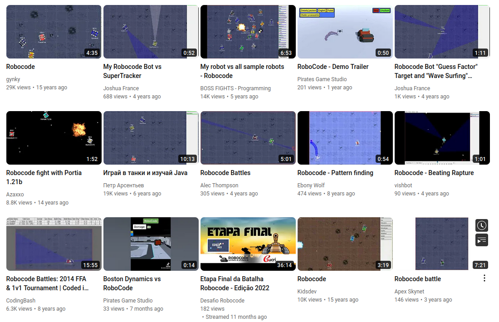

<!--
author:   Andrea Charão

email:    andrea@inf.ufsm.br

version:  0.0.1

language: PT-BR

narrator: Brazilian Portuguese Female

comment:  Material de apoio para a disciplina
          ELC117 - Paradigmas de Programação
          da Universidade Federal de Santa Maria

translation: English  translations/English.md

script:   https://cdn.jsdelivr.net/npm/mermaid@10.5.0/dist/mermaid.min.js


@onload
mermaid.initialize({ startOnLoad: false });
@end

@mermaid: @mermaid_(@uid,```@0```)

@mermaid_
<script run-once="true" modify="false" style="display:block; background: white">
async function draw () {
    const graphDefinition = `@1`;
    const { svg } = await mermaid.render('graphDiv_@0', graphDefinition);
    send.lia("HTML: "+svg);
    send.lia("LIA: stop")
};

draw()
"LIA: wait"
</script>
@end

@mermaid_eval: @mermaid_eval_(@uid)

@mermaid_eval_
<script>
async function draw () {
    const graphDefinition = `@input`;
    const { svg } = await mermaid.render('graphDiv_@0', graphDefinition);
    console.html(svg);
    send.lia("LIA: stop")
};

draw()
"LIA: wait"
</script>
@end


-->

<!--
nvm use v14.21.1
liascript-devserver --input README.md --port 3001 --live
https://liascript.github.io/course/?https://raw.githubusercontent.com/AndreaInfUFSM/elc117-2023b/master/classes/19/README.md
-->


[](https://liascript.github.io/course/?https://raw.githubusercontent.com/AndreaInfUFSM/elc117-2024b/main/classes/21/README.md)


# Programação Concorrente


> Este material faz parte de uma introdução ao paradigma de **programação concorrente**.


## Algo em comum?

Avance para ver alguns exemplos de software com código aberto...

> O que será que eles têm em comum?

### RoboCode


>*"Robocode is a programming game, where the goal is to develop a robot battle tank to battle against other tanks in Java. The robot battles are running in real-time and on-screen." "Build the best, destroy the rest"*. 

Documentação e código:

- https://robocode.sourceforge.io
- https://github.com/robo-code/robocode





Um vídeo: https://www.youtube.com/watch?v=8JJqc5-erVM

Muitos vídeos: https://www.youtube.com/channel/UC3Q0ZB31K8NK9CQvfxY1Q7A/home


### Spring Boot


> Um framework que facilita o processo de configuração e publicação de aplicações web. "Spring Boot uses a public static void main entry-point that launches an embedded web server for you"

Framework = *inversion of control* (https://en.wikipedia.org/wiki/Inversion_of_control)

Documentação e código:

- https://spring.io/projects/spring-boot
- https://github.com/spring-projects/spring-boot


Muitos vídeos: https://www.youtube.com/hashtag/springboot


## Programação Concorrente

> Execução **sequencial** de tarefas: `main` executa A -> B -> C -> D


Até então, você provavelmente só criou programas sequenciais...


### Programação sequencial

- Dependências determinam a sequência: por exemplo, ler dados antes de processá-los
- Em muitos casos, há tarefas independentes e mais de uma sequência possível, mas com programação sequencial não conseguimos expressar isso


Execução **sequencial** de tarefas: `main` executa A -> B -> C -> D


### Programação concorrente

Concorrência: um programa, múltiplas tarefas independentes em um intervalo de tempo


Wikipedia: https://en.wikipedia.org/wiki/Concurrency_%28computer_science%29

> *"In computer science, concurrency is the ability of different parts or units of a program, algorithm, or problem to be executed out-of-order or in partial order, without affecting the final outcome."*


Book: David Watt. Programming Language Design Concepts. Wiley, 2004.

> *"Concurrent programs are able to carry out more than one operation at a time."*


### (Não-)Determinismo


- Determinismo: execuções distintas, mesmo comportamento

  - Programas sequenciais são determinísticos
  - *"Correct sequential programs are deterministic. A deterministic program follows a sequence of steps that is completely reproducible in multiple executions with the same input."* (Watt, 2004)


- Não-determinismo: execuções distintas podem ter diferentes comportamentos

  - Por exemplo: ACBD ou ACDB ou BACD ou BDAC...
  - *"A concurrent program, on the other hand, is likely to be genuinely nondeterministic [...]. That is to say, we cannot predict either the sequence of steps that it takes or its final outcome"*. (Watt, 2004)
  - É necessário garantir resultados corretos mesmo diante de não-determinismo


### Concorrência X paralelismo

> Programas concorrentes podem executar em paralelo se hardware e SO permitirem

| Concorrência   | Paralelismo   |
| :--------- | :--------- |
| Concorrência lógica (Sebesta, 2018)     | Concorrência física (Sebesta, 2018)     |
| hardware não importa muito aqui | hardware é muito importante aqui |
| mais de uma tarefa no mesmo intervalo de tempo | mais de uma tarefa no mesmo instante de tempo |

Paralelismo


Concorrência


#### Analogia

Concorrência: um "dealer" empilhando dois montes de cartas em um intervalo de tempo


Paralelismo: dois "dealers" empilhando dois montes de cartas ao mesmo tempo


Fonte: https://developer.ibm.com/tutorials/reactive-in-practice-4/


## Para quê? 

- Desempenho
  
  - processamento intensivo, engines, arquiteturas multicore, etc.

- Reatividade/interatividade

  - GUIs, servidores, etc.

- Expressividade do código

  - tarefas independentes expressas separadamente


Fonte: http://pim2catalog.com/en/rapidite-reactivite-speed-reactivity/

## Como?

Muitas alternativas: 

- relação com arquiteturas e sistemas operacionais
- bibliotecas e linguagens
- threads, executors, coroutines, channels, futures/promises, ...

> Básico: **threads**


## Threads

- Processo = programa em execução
- Threads = fluxos de execução independentes em um programa / processo
- Recursos privados: contadores de programa, variáveis locais
- Recursos compartilhados


Fonte: Abraham Silberschatz, Greg Gagne, and Peter Baer Galvin, "Operating System Concepts, Ninth Edition ", Chapter 4 


### Programação com threads

Independente de linguagem:

1. Especificar código das tarefas independentes
2. Especificar dados próprios e/ou compartilhados
3. Controlar: ativação, término, interrupção
4. Sincronizar (competição/cooperação)

### Exemplos real-world

O que será que exemplos tão diferentes têm em comum?

Em [RoboCode](https://github.com/robo-code/robocode/tree/master/robocode.host/src/main/java/net/sf/robocode/host):

- https://github.com/search?q=repo%3Arobo-code%2Frobocode%20thread&type=code
- abstract class _RobotBase implements Runnable: https://github.com/robo-code/robocode/blob/master/robocode.api/src/main/java/robocode/_RobotBase.java

Em [Spring Boot](https://github.com/spring-projects/spring-boot/tree/main/spring-boot-project/spring-boot/src/main/java/org/springframework/boot/web/embedded) (servidor Web embutido):

- https://github.com/search?q=repo%3Aspring-projects%2Fspring-boot%20thread&type=code
- https://github.com/spring-projects/spring-boot/blob/main/spring-boot-project/spring-boot/src/main/java/org/springframework/boot/web/embedded/tomcat/TomcatWebServer.java


Em [libGDX](https://github.com/libgdx/libgdx/tree/master)

- https://github.com/search?q=repo%3Alibgdx%2Flibgdx+thread&type=code
- https://github.com/libgdx/libgdx/blob/master/backends/gdx-backend-lwjgl3/src/com/badlogic/gdx/backends/lwjgl3/Lwjgl3Application.java
  


## Threads em Java

Em Java: 

1. Especificar código das tarefas independentes

   - Método `run()` da classe `Thread` ou interface `Runnable`

2. Especificar dados próprios e/ou compartilhados

   - passar referências para objetos, acessar atributos de classe (`static`)

3. Controlar: ativação, término, interrupção

   - métodos `start()`, `join()`, `interrupt()` ...

4. Sincronizar (competição/cooperação)

   - `synchronized`, wait(), notify(), ...


### Herança: `extends Thread`

- Método `run` especifica tarefa a ser executada por uma thread
- Criação de objeto da classe Thread com new (como qualquer outra classe)
- Método `start` inicia a execução de uma thread independente
- Método `main` segue executando 

``` java
class MyThread extends Thread {
  public void run() {
    System.out.println("Trabalhando");
  }
}

class ThreadApp {
  public static void main(String[] args) {
    MyThread t1 = new MyThread();
    Thread t2 = new MyThread();
    t1.start();
    t2.start();
  }
}
```

### Método start

![Imagem ilustrando o funcionamento do método start em Java. A imagem tem 3 linhas do tempo horizontais, representando threads main, t1 e t2. Inicialmente, em main, é executado com t1.start(). Isso faz com que t1 passe a executar suas tarefas concorrentemente com main. As tarefas de t1 são A e B, que fazem parte do método run de t1. Após t1.start(), é executado t2.start() em main. Isso faz com que t2 passe também a executar concorrentemente com t1 e main. As tarefas de t2 são C e D, que fazem parte do método run de t2. ](img/Selection_014.png)

``` java
class MyThread extends Thread {
  public void run() {
    System.out.println("Trabalhando");
  }
}

class ThreadApp {
  public static void main(String[] args) {
    MyThread t1 = new MyThread();
    Thread t2 = new MyThread();
    t1.start();
    t2.start();
  }
}
```

### Método join

- Causa **espera (bloqueio)**
- Exige tratamento de exceção


``` java
class ThreadApp {
  public static void main(String[] args) {
    MyThread t1 = new MyThread();
    Thread t2 = new MyThread();
    t1.start();
    t2.start();
    try {
      t1.join();
      t2.join();
    } catch (InterruptedException e) {
	    // trata interrupcao
    }
  }
}
```

### Interface: `implements Runnable`

- Outra alternativa para expressar concorrência
- Objeto que implementa interface Runnable deve ser passado para um objeto Thread para execução de seu método run().


``` java
class MyRunnable implements Runnable {
  public void run() {
    System.out.println("Trabalhando");
  }
}

class ThreadApp {
  public static void main(String[] args) {
    MyRunnable r = new MyRunnable();
    Thread t1 = new Thread(r);
    Thread t2 = new Thread(r);
    t1.start();
    t2.start();
  }
}

```

## Prática

Avance para ver os exercícios desta prática...

### ThreadRace

- Analise o código do programa [ThreadRace.java](src/ThreadRace.java).

- Observe que este programa cria 2 threads concorrentes que representam animais em uma corrida: Rabbit e Turtle. O programa usa `extends Thread` e `implements Runnable`, conforme explicado nesta aula.

- Compile o programa ThreadRace.java. 

- Execute o programa mais de uma vez, observando as saídas. Você conseguiu notar o **não-determinismo** característico da execução concorrente?


### AnotherThreadRace

- Copie o programa ThreadRace.java para um arquivo nomeado AnotherThreadRace.java e renomeie a classe principal para AnotherThreadRace. 

- Acrescente uma terceira classe de animal à corrida e ajuste o método main para executar o novo animal em uma nova thread. Para isso, você poderá criar uma classe derivada de Thread (como foi feito na classe Rabbit) ou implementar a interface Runnable (como foi feito na classe Turtle).


### BetterThreadRace

- Observe que os métodos run() são muito semelhantes no código fornecido. Ou seja, há redundâncias nas classes dos animais, o que é indesejável. 

- Resolva este problema criando um novo programa em um arquivo BetterThreadRace.java, contendo uma classe base (super-classe) AnimalRunner, da qual serão derivadas as 3 classes de animais. Faça as modificações necessárias para que o novo programa funcione como o anterior.

- Extra: pesquise sobre **lambda expressions** e **functional interfaces** em Java, para abreviar o código que especifica o que as threads irão executar. Isso é programação funcional, do jeito Java :-)


### MandelbrotGenerator

Nesta parte da prática, você vai explorar OO e concorrência em [fractais de Mandelbrot](https://en.wikipedia.org/wiki/Mandelbrot_set)!


- Obtenha os códigos [MandelbrotGenerator.java](src/MandelbrotGenerator.java) e [TestMandelbrotGenerator.java](src/TestMandelbrotGenerator.java). 

- Na classe MandelbrotGenerator, você encontra uma implementação sequencial e uma implementação concorrente da geração de uma imagem. Matematicamente, o cálculo de cada pixel não depende de valores de outros pixels, por isso esse problema se presta bem para o uso de programação concorrente/paralela.

- Compile e execute o programa, observando as imagens geradas e possíveis diferenças nos tempos de execução. Existe algum indício de threads trabalhando ao mesmo tempo (em paralelo)?

- Gere outras imagens, variando parâmetros (tamanho da imagem, centro, zoom, iterações, número de threads). 


## Bibliografia


Robert Sebesta. Conceitos de Linguagens de Programação. Bookman, 2018. Disponível no Portal de E-books da UFSM: http://portal.ufsm.br/biblioteca/leitor/minhaBiblioteca.html (Capítulo 13)


