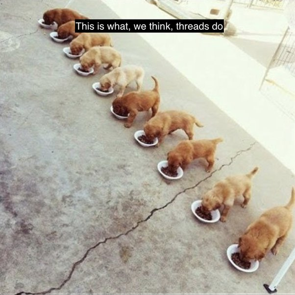
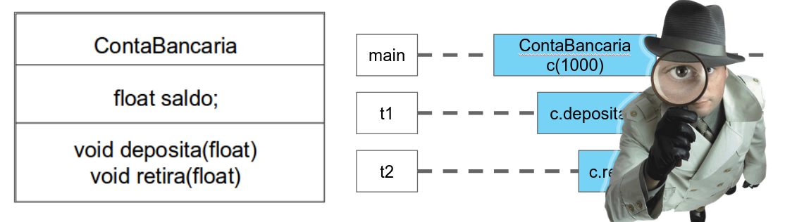

<!--
author:   Andrea Charão

email:    andrea@inf.ufsm.br

version:  0.0.1

language: PT-BR

narrator: Brazilian Portuguese Female

comment:  Material de apoio para a disciplina
          ELC117 - Paradigmas de Programação
          da Universidade Federal de Santa Maria

translation: English  translations/English.md

-->

<!--
nvm use v14.21.1
liascript-devserver --input README.md --port 3001 --live
https://liascript.github.io/course/?https://raw.githubusercontent.com/AndreaInfUFSM/elc117-2023b/master/classes/19/README.md
-->

[](https://liascript.github.io/course/?https://raw.githubusercontent.com/AndreaInfUFSM/elc117-2024b/main/classes/22/README.md)


# Programação Concorrente


> Este material faz parte de uma introdução ao paradigma de **programação concorrente**.

### Quiz

> AGUARDE instruções da professora antes de fazer este quiz!

1. Um programa concorrente cria 2 threads, X e Y, e aguarda que terminem suas execuções. 

   A thread X faz um cálculo e mostra o resultado `X=42`. 
   
   A thread Y faz outro cálculo e mostra o resultado `Y=81`. 
   
   A saída abaixo é uma possível saída desse programa?

   ```
   Y=81
   X=42
   ```

   - [(sim)] Sim
   - [(nao)] Não


2. O programa pode produzir esta saída?

   ```
   X=42
   Y=81
   ```

   - [(sim)] Sim
   - [(nao)] Não

3. Considere um programa em Java que declara uma classe `Simulator` derivada de `Thread`.

   O método `main` deste programa tem a seguinte linha de código: 

   `Simulator s = new Simulator();`

   Supondo que `main` execute sequencialmente até a linha acima, qual dos códigos abaixo ativa a execução concorrente deste programa?

   - [(run)] `s.run();`
   - [(start)] `s.start();`


### Concorrência no dia-a-dia


> Diariamente, preparar **café da manhã**: café com leite + pão torrado com geleia

Tarefas:

```
pegar xícara em armário
pegar leite em geladeira
pegar colher em gaveta
pegar café em armário
pegar geleia em geladeira
pegar pão em armário
pegar faca em gaveta

servir leite na xícara
aquecer leite no microondas
adicionar café em pó ao leite com colher
cortar fatia de pão com faca
tostar fatia de pão na torradeira
passar geleia no pão com faca

```

Questões:

1. Quantos/quais são os processadores (que executam as tarefas)?
2. Podemos chegar ao mesmo resultado alterando a ordem de algumas tarefas?
3. Que tarefas podem ser feitas ao mesmo tempo?
4. Que tarefas precisam ser feitas em sequência (uma depende do resultado de outra)?


### Threads


- Threads = fluxos de execução independentes em um programa / processo
- Recursos privados: contadores de programa, variáveis locais
- Recursos **compartilhados**


Fonte: Abraham Silberschatz, Greg Gagne, and Peter Baer Galvin, "Operating System Concepts, Ninth Edition ", Chapter 4 

## Recursos compartilhados

1. O que seriam "recursos" neste exemplo? 
2. Há tarefas independentes que **compartilham** recursos?
3. O que acontece se tivermos 4 pessoas preparando café da manhã na mesma cozinha?

```
pegar xícara em armário
pegar leite em geladeira
pegar colher em gaveta
pegar café em pó em armário
pegar geleia em geladeira
pegar pão em armário
pegar faca em gaveta

servir leite na xícara
aquecer leite no microondas
adicionar café em pó ao leite com colher
cortar fatia de pão com faca
tostar fatia de pão na torradeira
passar geleia no pão com faca

```


### Um meme :-)
Competição por recursos compartilhados virou até meme :-)

https://imgur.com/a/QGUdTw7

This is what we think threads do


This is what they actually do


### Um exemplo clássico

Um problema clássico de concorrência que ilustra competição por recursos compartilhados:


Fonte: https://web.mit.edu/6.005/www/fa14/classes/20-queues-locks/synchronization/


### Classe ContaBancaria

- Classe ContaBancaria encapsula atributo saldo e métodos para movimentar uma conta
- Thread principal cria uma conta e passa referência para threads t1 e t2
- Threads t1 e t2 compartilham a conta e fazem operações concorrentes sobre ela


### ContaBancaria em Java

> Este exemplo tem um problema de execução concorrente!

Classe `Conta`: saldo e métodos para movimentar a conta

``` java
class Conta {

  private float saldo = 0f;

  public Conta(float inicial) {
    saldo = inicial;
  }

  public float getSaldo() {
    return saldo;
  }

  public void deposita(float valor) {
    saldo += valor;
  }

  public void retira(float valor) {
    saldo -= valor;
  }
```

Classe `Operacoes` faz múltiplos depósitos e retiradas

``` java
class Operacoes implements Runnable {

  private Conta c;
  private int n;
  private int valor_credito;
  private int valor_debito;

  public Operacoes(Conta c, int n, int valor_credito, int valor_debito) {
    this.c = c;
    this.n = n;
    this.valor_credito = valor_credito;
    this.valor_debito = valor_debito;
  }

  @Override
  public void run() {
    for (int i = 0; i < n; i++) {
      c.deposita(valor_credito);
      c.retira(valor_debito);
    }
  }
}
```

Classe principal:

- cria conta 
- passa conta para transação
- cria threads que com acesso a objeto compartilhado

``` java
class TransacoesBancarias {

  public static void main(String[] args) {
  
    Conta c = new Conta(0);
    // 1000 depósitos de 10 e 1000 retiradas de 5 = 5000
    Runnable operacoes = new Operacoes(c, 1000, 10, 5);
    
    // Cria 2 objetos da classe Thread
    Thread thread1 = new Thread(operacoes); // 5000
    Thread thread2 = new Thread(operacoes); // 5000

    // Ativa execução das threads
    thread1.start();
    thread2.start();

    // Aguarda término das threads
    try {
      thread1.join();
      thread2.join();
    } catch (InterruptedException e) {
      e.printStackTrace();
    }

    // Saldo deveria ser 10000
    System.out.println("Saldo final: " + c.getSaldo());
  }
}
```

### Zoom na execução

- Sistema operacional escalona execução das threads
- Tarefas podem ser interrompidas para que outras executem
- Ver "preemption": https://en.wikipedia.org/wiki/Preemption_%28computing%29
- Depósitos e retiradas acarretam várias instruções na CPU
- A seguir, veremos um "zoom" em uma execução em SO preemptivo




                 {{1}}
************************************************

saldo inicial compartilhado = 1000, t1 escalonado primeiro, t2 depois: saldo = 1200


************************************************

                 {{2}}
************************************************

saldo inicial compartilhado = 1000, t1 sofre preempção, t2 executa: saldo = 900 ?!


************************************************


### Race condition

- Condição de corrida: concorrência no acesso a recursos compartilhados provoca diferentes resultados, dependendo da ordem
- Resultados possivelmente indesejados / inconsistentes (bug difícil de identificar e corrigir!)
- Ver: https://en.wikipedia.org/wiki/Race_condition
- Soluções geralmente exigem sincronização entre threads 


![Imagem esquemática de 2 cruzamentos entre estradas com vias paralelas. Na metade esquerda da imagem, é ilustrado um conflito quando um carro de uma estrada chega no cruzamento e se encontra com um carro vindo da outra estrada, em um ponto em que 2 vias coincidem. O cruzamento representa um recurso compartilhado. Na metade direita da imagem, é ilustrada uma situação em que não há conflito, quando carros passam no cruzamento em vias que não coincidem (um carro indo e outro voltando na mesma estrada).](img/The-conflict-and-concurrent-lanes.jpeg)

Fonte: https://www.researchgate.net/figure/The-conflict-and-concurrent-lanes_fig14_304612287
  


## Sincronização entre threads


Problema

- Inconsistência de dados
- Condição de corrida (race condition)

Solução

- Identificar dados compartilhados e seção crítica (onde ocorre conflito)
- Aplicar exclusão mútua / locks, semáforos, etc.


Fonte: [Notícia Portal RIC](https://ric.com.br/prja/seguranca/acidentes/caminhonete-passa-por-cima-de-carro-e-mata-motorista-em-ponte-estreita-de-araucaria/)


Fonte: [Notícia Grupo RBJ de Comunicação](https://rbj.com.br/condutor-de-caminhao-ignora-sinalizacao-e-atinge-toldo-da-ponte-estreita-em-marmeleiro/)


### Exclusão mútua em Java


- Palavra-chave `synchronized` e/ou recursos do pacote `java.util.concurrent` (locks, atomic)

- Exclusão mútua com `synchronized`: 

  - palavra-chave adicionada a seções críticas (métodos / blocos de código)
  - quando threads fazem operações `synchronized` ao mesmo tempo sobre um mesmo dado/objeto

    - só uma executa por vez
    - outras aguardam liberação

- É uma (pequena) limitação à concorrência

- Em SO serão vistos outros mecanismos de sincronização / exclusão mútua (em C)


``` java
class Conta {

  private float saldo = 0f;

  public Conta(float inicial) {
    saldo = inicial;
  }

  public float getSaldo() {
    return saldo;
  }

  public synchronized void deposita(float valor) {
    saldo += valor;
  }

  public synchronized void retira(float valor) {
    saldo -= valor;
  }
```

### Em outras linguagens

- Threads e sincronização são recursos de programação que existem em muitas linguagens

- Por exemplo:

  - TypeScript: http://web.mit.edu/6.031/www/fa21/classes/23-mutual-exclusion/
  - C: https://courses.cs.washington.edu/courses/cse333/20au/lectures/26-threads-code/lock_example.cc.html


### Entrevista com criador da linguagem Elixir

- Elixir é uma linguagem de programação funcional criada por José Valim, um desenvolvedor brasileiro
- Antes de criar Elixir, ele trabalhava como mantenedor da plataforma Ruby on Rails
- A criação de Elixir foi motivada por problemas de concorrência identificados em Ruby on Rails


Entrevista (março/2023): https://youtu.be/LrwsBqOovnE

"Por que você decidiu criar o Elixir?" https://youtu.be/LrwsBqOovnE?t=1236

<iframe width="1009" height="568" src="https://www.youtube.com/embed/LrwsBqOovnE?start=1236" title="DEV Talks #01 - José Valim" frameborder="0" allow="autoplay; clipboard-write; picture-in-picture; web-share" allowfullscreen></iframe>


## Prática


Avance...


### Quiz

Considere o seguinte código:

``` java
class SharedObjectExample {
  private int sharedValue;

  public SharedObjectExample(int value) {
    this.sharedValue = value;
  }

  public void updateValue(int newValue) {
    sharedValue = newValue;
  }

  public int getValue() {
    return sharedValue;
  }
}

```

1. Considerando o código acima, qual das linhas de código abaixo instancia um objeto da classe SharedObjectExample?

   - [( )] SharedObjectExample e = new SharedObjectExample();
   - [(x)] SharedObjectExample e = new SharedObjectExample(10);


2. Suponha que existam várias threads acessando instâncias da classe SharedObjectExample. Qual das afirmações abaixo é correta a respeito do compartilhamento de objetos da classe SharedObjectExample?

   - [( )] Objetos da classe SharedObjectExample sào sempre compartilhados entre threads.
   - [(x)] O compartilhamento de objetos da classe SharedObjectExample é definido por quem usa a classe.
   - [( )] Objetos da classe SharedObjectExample não podem ser compartilhados porque são privados.
   - [( )] Objetos da classe SharedObjectExample são automaticamente `synchronized`, tornando-os thread-safe.


### TransacoesBancarias

- Analise o código de [TransacoesBancarias.java](src/TransacoesBancarias.java) e identifique qual é o saldo inicial, quais são os depósitos e retiradas, e qual é saldo final esperado após todos os depósitos e retiradas.

- Compile o programa TransacoesBancarias.java.

- Execute a classe principal mais de uma vez, até obter um resultado diferente do esperado (ou seja, um resultado errado!). Você pode usar um script fornecido para isso:

  ``` bash
  bash repete-execucao.sh 10 java TransacoesBancarias
  ```
  O comando acima repete a execução do programa até 10 vezes, mas para quando os resultados de 2 execuções consecutivas forem diferentes.

- Corrija o problema, usando `synchronized` na classe Conta (quais são os métodos que devem ser "protegidos" com exclusão mútua?).


### SharedCounter

- Analise o código de [SharedCounter.java](src/SharedCounter.java). Identifique qual deve ser a saída correta após as operações realizadas.

- Compile o programa SharedCounter.java.

- Execute a classe principal mais de uma vez, até obter um resultado diferente do esperado (errado!).

- Corrija o problema, identificando a classe do objeto compartilhado e o código que deve ser executado em exclusão mútua.

- Execute o programa novamente, mais de uma vez, para verificar se a correção funcionou.


## Bibliografia


Robert Sebesta. Conceitos de Linguagens de Programação. Bookman, 2018. Disponível no Portal de E-books da UFSM: http://portal.ufsm.br/biblioteca/leitor/minhaBiblioteca.html (Capítulo 13)


