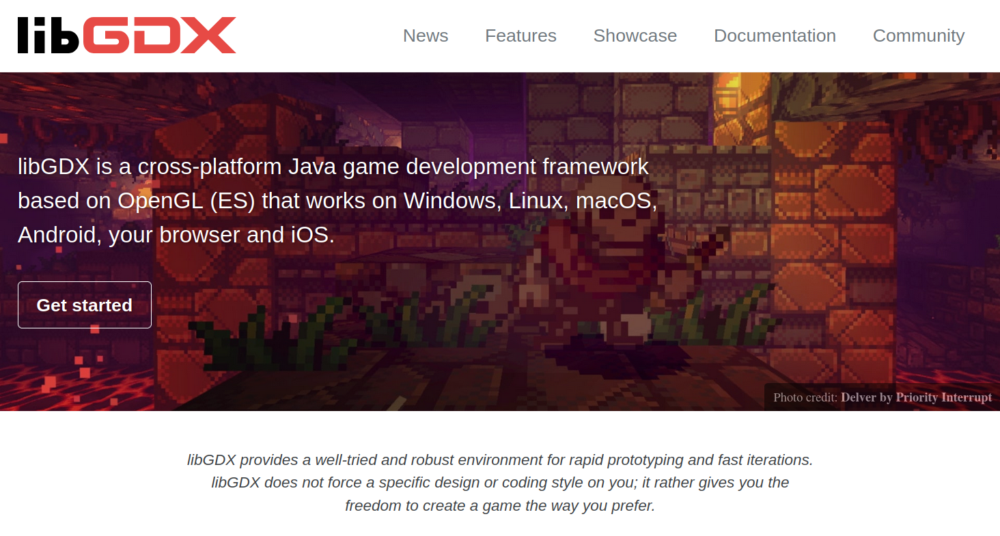
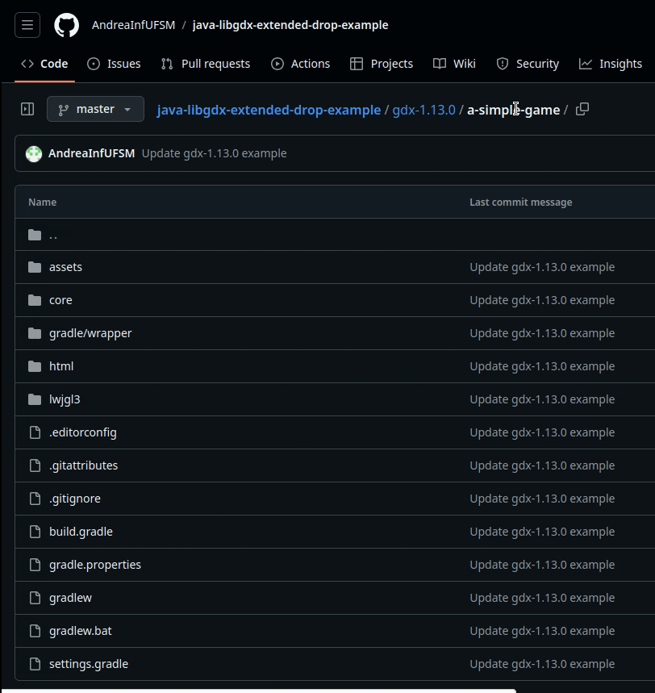
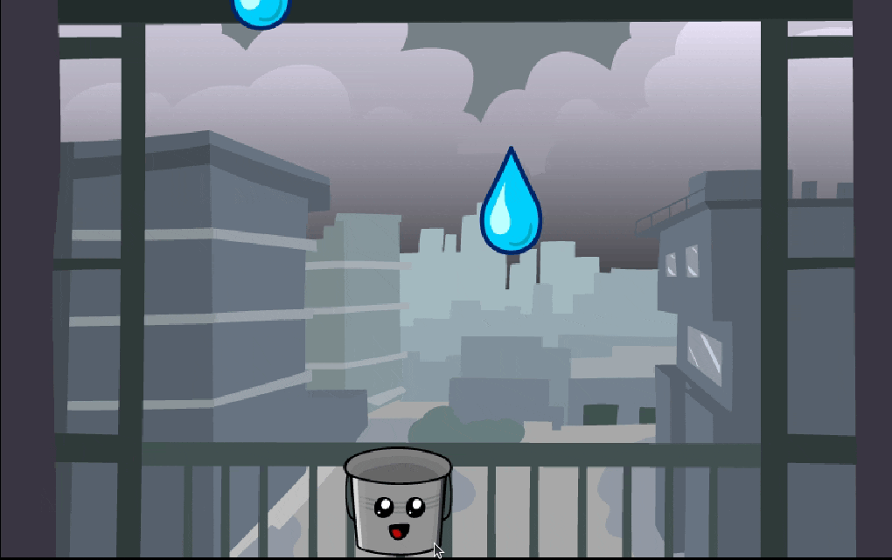
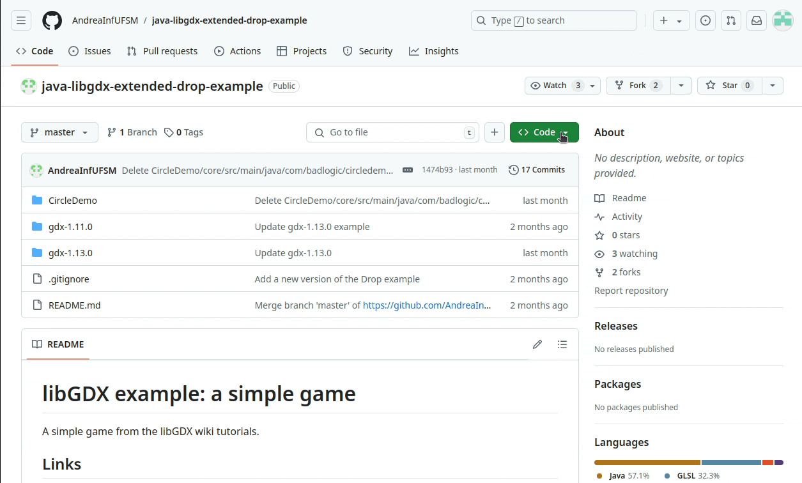

<!--
author:   Andrea Charão

email:    andrea@inf.ufsm.br

version:  0.0.1

language: PT-BR

narrator: Brazilian Portuguese Female

comment:  Material de apoio para a disciplina
          ELC117 - Paradigmas de Programação
          da Universidade Federal de Santa Maria

translation: English  translations/English.md

-->

<!--
nvm use v14.21.1
liascript-devserver --input README.md --port 3001 --live
https://liascript.github.io/course/?https://raw.githubusercontent.com/AndreaInfUFSM/elc117-2024b/master/classes/25/README.md
-->

[](https://liascript.github.io/course/?https://raw.githubusercontent.com/AndreaInfUFSM/elc117-2024b/main/classes/25/README.md)


# Game Orientado a Objetos com libGDX

> Crie um jogo multiplataforma em Java reusando muitas, muitas classes



### Configuração de projeto

- Projeto = código-fonte, arquivos de configuração e dependências
- Projetos libGDX são gerenciados com a ferramenta [Gradle](https://gradle.org/)
- Alternativas para iniciar projeto

  - Alternativa 1: Ferramenta oficial `gdx-liftoff`: 

    https://libgdx.com/wiki/start/project-generation

  - Alternativa 2: Clonar algum projeto existente, por exemplo: 

    https://github.com/AndreaInfUFSM/java-libgdx-extended-drop-example/

  - ~Alternativa 3: Configurar projeto Gradle manualmente~





#### Organização dos arquivos

https://libgdx.com/wiki/start/project-generation#project-layout

```
gradle.properties          <- global variables used to define version numbers throughout the project
settings.gradle            <- definition of sub-modules. By default core, desktop, android, html, ios
build.gradle               <- main Gradle build file
gradlew                    <- local Gradle wrapper
gradlew.bat                <- script that will run Gradle on Windows
local.properties           <- IntelliJ only file, defines Android SDK location

assets/                    <- contains your graphics, audio, etc.

core/
    build.gradle           <- Gradle build file for core project. Defines dependencies throughout the project.
    src/                   <- Source folder for all your game's code

lwjgl3/
    build.gradle           <- Gradle build file for desktop project. Defines desktop only dependencies.
    src/                   <- Source folder for your desktop project, contains LWJGL launcher class

android/
    build.gradle           <- Gradle build file for android project. Defines Android only dependencies.
    AndroidManifest.xml    <- Android specific config
    res/                   <- contains icons for your app and other resources
    src/                   <- Source folder for your Android project, contains android launcher class

html/
    build.gradle           <- Gradle build file for the html project. Defines GWT only dependencies.
    src/                   <- Source folder for your html project, contains launcher and html definition
    webapp/                <- War template, on generation the contents are copied to war. Contains startup url index page and web.xml

ios/
    build.gradle           <- Gradle build file for the iOS project. Defines iOS only dependencies.
    src/                   <- Source folder for your iOS project, contains launcher

```


### Target platform: HTML / web

- Jogo libGDX em Java pode ser convertido com GWT (Google Web Toolkit) para executar em navegador web
- Veja aqui sobre as plataformas suportadas, especialmente HTML: https://libgdx.com/wiki/start/import-and-running
- **ATENÇÃO!** Alguns recursos de jogo para desktop não funcionam quando convertidos para web


#### ⚠️ Atenção na conversão para web

- **ATENÇÃO!** Alguns recursos de jogo para desktop não funcionam quando convertidos para web
- Faça build `gradlew html:dist` desde o início do desenvolvimento do seu projeto!
- HTML5 Backend and GWT Specifics: https://libgdx.com/wiki/html5-backend-and-gwt-specifics


### Application Life Cycle

- https://libgdx.com/wiki/app/the-life-cycle
- *A libGDX application has a well defined life-cycle, governing the states of an application, like creating, pausing and resuming, rendering and disposing the application.*
- interface `ApplicatioListener` é muito importante


### Exemplo de projeto


- No GitHub: https://github.com/AndreaInfUFSM/java-libgdx-extended-drop-example/tree/master/gdx-1.13.0/a-simple-game
- Baseado neste exemplo: https://libgdx.com/wiki/start/a-simple-game
- Deploy web em: https://libgdx.com/libgdx-wiki-examples/a-simple-game/index.html




### 🚀 Prática no Codespaces

- No GitHub Codespaces:

  - Clonar este projeto e seguir instruções no README: https://github.com/AndreaInfUFSM/java-libgdx-extended-drop-example  
  - Fazer build para web conforme instruções e testar o jogo no navegador
  - Note que, no Codespaces, build para desktop/lwjgl3 não executa (sem acesso a ambiente gráfico)
  

- **Exercício**: entenda e modifique o jogo

  - Localize onde é criado um novo pingo
  - Localize onde ocorre a colisão do pingo com o balde
  - Adicione um contador de pingos no balde: primeiro modifique o código para exibir um contador no terminal, depois na tela do jogo
  - Modifique a velocidade dos pingos depois que o jogo atingir um certo número de pingos no balde





### Examinando um projeto (1): jogo com uma tela

Projeto: https://github.com/AndreaInfUFSM/java-libgdx-extended-drop-example/tree/master/gdx-1.13.0/a-simple-game

Deploy web em: https://libgdx.com/libgdx-wiki-examples/a-simple-game/index.html

Estrutura do projeto:

- [assets](https://github.com/AndreaInfUFSM/java-libgdx-extended-drop-example/tree/master/gdx-1.13.0/a-simple-game/assets): arquivos de imagens, áudio, etc.
- [core](https://github.com/AndreaInfUFSM/java-libgdx-extended-drop-example/tree/master/gdx-1.13.0/a-simple-game/core): é nesta pasta que fica a maior parte do código do projeto
- [lwjgl3](https://github.com/AndreaInfUFSM/java-libgdx-extended-drop-example/tree/master/gdx-1.13.0/a-simple-game/lwjgl3): código específico para versão desktop (em versões mais antigas, ficava na pasta desktop). Gerado automaticamente, em geral não precisa ser modificado
- [html](https://github.com/AndreaInfUFSM/java-libgdx-extended-drop-example/tree/master/gdx-1.13.0/a-simple-game/html): código específico para versão web. Gerado automaticamente, em geral não precisa ser modificado

Obs.: Esta estrutura pode mudar dependendo de como o projeto Gradle foi gerado (versão da libGDX, IDE, etc.)


#### Classe `Main`

- [`class Main implements ApplicationListener`](https://github.com/AndreaInfUFSM/java-libgdx-extended-drop-example/blob/master/gdx-1.13.0/a-simple-game/core/src/main/java/com/badlogic/drop/Main.java): jogo muito simples, todo código em uma classe!
- Tem vários atributos que representam elementos do jogo
- Sobrescreve métodos `create()`, `resize()` e  `render()`


```java
public class Main implements ApplicationListener {
    Texture backgroundTexture;
    Texture bucketTexture;
    Texture dropTexture;
    Sound dropSound;
    Music music;
    SpriteBatch spriteBatch;
    FitViewport viewport;
    Sprite bucketSprite;
    Vector2 touchPos;
    Array<Sprite> dropSprites;
    float dropTimer;
    Rectangle bucketRectangle;
    Rectangle dropRectangle;
    public boolean clickedSplash;
    Texture splashTexture;
    ScreenViewport screenViewport;
    public Preloader preloader;

    @Override
    public void create() {
        backgroundTexture = new Texture("background.png");
        bucketTexture = new Texture("bucket.png");
        dropTexture = new Texture("drop.png");
        dropSound = Gdx.audio.newSound(Gdx.files.internal("drop.mp3"));
        spriteBatch = new SpriteBatch();
        viewport = new FitViewport(8, 5);
        bucketSprite = new Sprite(bucketTexture);
        bucketSprite.setSize(1, 1);
        touchPos = new Vector2();
        dropSprites = new Array<>();
        bucketRectangle = new Rectangle();
        dropRectangle = new Rectangle();
        splashTexture = new Texture("splash.png");
        screenViewport = new ScreenViewport();
    }

    @Override
    public void resize(int width, int height) {
        viewport.update(width, height, true);
        screenViewport.update(width, height, true);
    }

    @Override
    public void render() {
        if (!clickedSplash) splashRender();
        else {
            input();
            logic();
            draw();
        }
    }

    private void input() {
        float speed = 4f;
        float delta = Gdx.graphics.getDeltaTime();

        if (Gdx.input.isKeyPressed(Input.Keys.RIGHT)) {
            bucketSprite.translateX(speed * delta);
        } else if (Gdx.input.isKeyPressed(Input.Keys.LEFT)) {
            bucketSprite.translateX(-speed * delta);
        }

        if (Gdx.input.isTouched()) {
            touchPos.set(Gdx.input.getX(), Gdx.input.getY());
            viewport.unproject(touchPos);
            bucketSprite.setCenterX(touchPos.x);
        }
    }

    private void logic() {
        float worldWidth = viewport.getWorldWidth();
        float worldHeight = viewport.getWorldHeight();
        float bucketWidth = bucketSprite.getWidth();
        float bucketHeight = bucketSprite.getHeight();

        bucketSprite.setX(MathUtils.clamp(bucketSprite.getX(), 0, worldWidth - bucketWidth));

        float delta = Gdx.graphics.getDeltaTime();
        bucketRectangle.set(bucketSprite.getX(), bucketSprite.getY(), bucketWidth, bucketHeight);

        for (int i = dropSprites.size - 1; i >= 0; i--) {
            Sprite dropSprite = dropSprites.get(i);
            float dropWidth = dropSprite.getWidth();
            float dropHeight = dropSprite.getHeight();

            dropSprite.translateY(-2f * delta);
            dropRectangle.set(dropSprite.getX(), dropSprite.getY(), dropWidth, dropHeight);

            if (dropSprite.getY() < -dropHeight) dropSprites.removeIndex(i);
            else if (bucketRectangle.overlaps(dropRectangle)) {
                dropSprites.removeIndex(i);
                dropSound.play();
            }
        }

        dropTimer += delta;
        if (dropTimer > 1f) {
            dropTimer = 0;
            createDroplet();
        }
    }

    private void draw() {
        ScreenUtils.clear(Color.BLACK);
        viewport.apply();
        spriteBatch.setProjectionMatrix(viewport.getCamera().combined);
        spriteBatch.begin();

        float worldWidth = viewport.getWorldWidth();
        float worldHeight = viewport.getWorldHeight();

        spriteBatch.draw(backgroundTexture, 0, 0, worldWidth, worldHeight);
        bucketSprite.draw(spriteBatch);

        for (Sprite dropSprite : dropSprites) {
            dropSprite.draw(spriteBatch);
        }

        spriteBatch.end();
    }

    private void splashRender() {
        if (Gdx.input.isTouched()) {
            clickedSplash = true;

            preloader.preloadBundle("delayed-loading", bundle -> {
                music = Gdx.audio.newMusic(Gdx.files.internal("delayed-loading/music.mp3"));
                music.setLooping(true);
                music.setVolume(.5f);
                music.play();
            });
        }

        float worldWidth = viewport.getWorldWidth();
        float worldHeight = viewport.getWorldHeight();

        ScreenUtils.clear(Color.BLACK);

        viewport.apply();
        spriteBatch.setProjectionMatrix(viewport.getCamera().combined);
        spriteBatch.begin();

        spriteBatch.draw(backgroundTexture, 0, 0, worldWidth, worldHeight);

        spriteBatch.flush();

        screenViewport.apply();
        spriteBatch.setProjectionMatrix(screenViewport.getCamera().combined);
        spriteBatch.draw(splashTexture, MathUtils.round(screenViewport.getWorldWidth() / 2f - splashTexture.getWidth() / 2f), MathUtils.round(screenViewport.getWorldHeight() / 2f - splashTexture.getHeight() / 2f));

        spriteBatch.end();
    }

    private void createDroplet() {
        float dropWidth = 1;
        float dropHeight = 1;
        float worldWidth = viewport.getWorldWidth();
        float worldHeight = viewport.getWorldHeight();

        Sprite dropSprite = new Sprite(dropTexture);
        dropSprite.setSize(dropWidth, dropHeight);
        dropSprite.setX(MathUtils.random(0f, worldWidth - dropWidth));
        dropSprite.setY(worldHeight);
        dropSprites.add(dropSprite);
    }

    @Override
    public void pause() {

    }

    @Override
    public void resume() {

    }

    @Override
    public void dispose() {

    }
}
```

### Examinando um projeto (2): jogo com duas telas

Projeto: https://github.com/AndreaInfUFSM/java-libgdx-extended-drop-example/tree/master/gdx-1.11.0

Deploy web em: https://www-usr.inf.ufsm.br/~andrea/extended-drop-example/

Estrutura do projeto:

- [assets](https://github.com/AndreaInfUFSM/java-libgdx-extended-drop-example/tree/master/gdx-1.11.0/assets): arquivos de imagens, áudio, etc.
- [core](https://github.com/AndreaInfUFSM/java-libgdx-extended-drop-example/tree/master/gdx-1.11.0/core): é nesta pasta que fica a maior parte do código do projeto
- [desktop](https://github.com/AndreaInfUFSM/java-libgdx-extended-drop-example/tree/master/gdx-1.11.0/desktop): código específico para versão desktop (em versões mais recentes, substituído por pasta lwjgl3). Gerado automaticamente, em geral não precisa ser modificado
- [html](https://github.com/AndreaInfUFSM/java-libgdx-extended-drop-example/tree/master/gdx-1.11.0/html): código específico para versão web. Gerado automaticamente, em geral não precisa ser modificado

Obs.: Esta estrutura pode mudar dependendo de como o projeto Gradle foi gerado (versão da libGDX, IDE, etc.)


#### Classe `Drop`

- Sobrescreve método `create` para configurar principais componentes do jogo
- Passa adiante sua referência `this` para `MainMenuScreen`, que vai continuar a execução
- Tem atributos públicos (prática duvidosa, mas pode se justificar)
- Quem cria um objeto `Drop`? É o launcher específico para desktop, web, etc.

``` java
public class Drop extends Game {
	
	public SpriteBatch batch;
	public BitmapFont font;
	
	@Override
	public void create () {
		batch = new SpriteBatch();
		// Use libGDX's default Arial font
		font = new BitmapFont();
		this.setScreen(new MainMenuScreen(this));
	}

	@Override
	public void render () {
		super.render(); // important!
	}
	
	public void dispose() {
		batch.dispose();
		font.dispose();
	}
}
```

#### Classe `MainMenuScreen`

- No construtor, recebe acesso ao objeto que a criou
- Observe nos atributos:

  - `final`: modificador de acesso que impede alteração/sobrescrita
  - `static`: modificador que vincula atributo/método globalmente à classe (não a cada objeto)

- Método `render`

  - Implementa lógica do que acontece nesta tela
  - Cria outra tela (classe `GameScreen`) 

``` java
public class MainMenuScreen implements Screen {
	final Drop game;
	static private int WIDTH = 800;
	static private int HEIGHT = 480;
	
	OrthographicCamera camera;
	
	public MainMenuScreen(final Drop passed_game) {
		game = passed_game;
		
		camera = new OrthographicCamera();
		camera.setToOrtho(false, WIDTH, HEIGHT);
	}
	
	@Override
	public void render(float delta) {
		Gdx.gl.glClearColor(0, 0, 0.2f, 1);
		Gdx.gl.glClear(GL20.GL_COLOR_BUFFER_BIT);
		
		camera.update();
		game.batch.setProjectionMatrix(camera.combined);
		
		game.batch.begin();
		game.font.draw(game.batch, "Welcome to Drop!!", 100, 150);
		game.font.draw(game.batch, "Tap anywhere to begin!", 100, 100);
		game.batch.end();
		
		// If player activates the game, dispose of this menu.
		if (Gdx.input.isTouched()) {
			game.setScreen(new GameScreen(game));
			dispose();
		}
	}


	@Override
	public void resize(int width, int height) {
		// TODO Auto-generated method stub
		
	}

	@Override
	public void show() {
		// TODO Auto-generated method stub
		
	}

	@Override
	public void hide() {
		// TODO Auto-generated method stub
		
	}

	@Override
	public void resume() {
		// TODO Auto-generated method stub
		
	}

	@Override
	public void dispose() {
		// TODO Auto-generated method stub
		
	}

	@Override
	public void pause() {
		// TODO Auto-generated method stub
		
	}
}
```


#### Classe `GameScreen`

- É a classe mais importante deste jogo
- Tem muitos atributos e métodos
- Observe o construtor!
- Tem alguns valores hardcoded (prática duvidosa)
- Descubra!

  - Como são criadas as gotas em posições aleatórias?
  - Como é detectada a colisão balde-gota?

  

``` java
public class GameScreen implements Screen {
	final Drop game;
	
	Texture dropImage;
	Texture bucketImage;
	Sound dropSound;
	Music rainMusic;
	OrthographicCamera camera;
	SpriteBatch batch;
	Rectangle bucket;
	Vector3 touchPos;
	Array<Rectangle> raindrops;
	long lastDropTime;
	int dropsGathered;
	
	public GameScreen(final Drop passed_game) {
		game = passed_game; 
		
		// Load images, 64px each
		dropImage = new Texture(Gdx.files.internal("droplet.png"));
		bucketImage = new Texture(Gdx.files.internal("bucket.png"));
		
		// Load the drop sfx and the rain background music
		dropSound = Gdx.audio.newSound(Gdx.files.internal("drop.wav"));
		rainMusic = Gdx.audio.newMusic(Gdx.files.internal("rain.mp3"));
		
		// Start playback of music in bg
		rainMusic.setLooping(true);
		rainMusic.play();
		
		// Init the camera objects.
		camera = new OrthographicCamera();
		camera.setToOrtho(false, 800, 480);
		touchPos = new Vector3();
		
		batch = new SpriteBatch();
		
		bucket = new Rectangle();
		// Screen Width - Image Width 
		bucket.width = 64;
		bucket.x = 800 / 2 - bucket.width / 2;
		bucket.y = 20;
		bucket.height = 64;
		
		// Create Raindrops and spawn the first one.
		raindrops = new Array<Rectangle>();
		spawnRaindrop();
	}

	@Override
	public void render(float delta) {
		/* Clear screen with a dark blue color.
		 * Arguments to ClearColor are r g b, alpha
		 */
		Gdx.gl.glClearColor(0, 0, .2f, 1);
		Gdx.gl.glClear(GL20.GL_COLOR_BUFFER_BIT);
		camera.update();
		
		game.batch.setProjectionMatrix(camera.combined);
		game.batch.begin();
		game.font.draw(game.batch, "Drops Collected: " + dropsGathered, 0, 400);
		// Draw the bucket and all the drops.
		game.batch.draw(bucketImage, bucket.x, bucket.y);
		for (Rectangle raindrop: raindrops) {
			game.batch.draw(dropImage, raindrop.x, raindrop.y);
		}
		game.batch.end();
		
		// Process any user input
		if (Gdx.input.isTouched()) {
			touchPos.set(Gdx.input.getX(), Gdx.input.getY(), 0);
			camera.unproject(touchPos);
			bucket.x = touchPos.x - bucket.width / 2;
		}
		
		// Ensure that the bucket's within the screen bounds
		if (Gdx.input.isKeyPressed(Keys.LEFT)) 
			bucket.x -= 200 * Gdx.graphics.getDeltaTime();
		if (Gdx.input.isKeyPressed(Keys.RIGHT)) 
			bucket.x += 200 * Gdx.graphics.getDeltaTime();
		if (bucket.x < 0) 
			bucket.x = 0;
		if (bucket.x > 800 - bucket.width) 
			bucket.x = 800 - bucket.width;
		
		// Check time since last raindrop. Do we need another?
		if (TimeUtils.nanoTime() - lastDropTime > 1000000000) 
			spawnRaindrop();
		
		// Update all the raindrops
		Iterator<Rectangle> iter = raindrops.iterator();
		while (iter.hasNext()) {
			Rectangle raindrop = iter.next();
			raindrop.y -= 200 * Gdx.graphics.getDeltaTime();
			if (raindrop.y + raindrop.height < 0) 
				iter.remove();
			if (raindrop.overlaps(bucket)) {
				dropsGathered++;
				dropSound.play();
				iter.remove();
			}
		}
	}
	
	private void spawnRaindrop() {
		Rectangle raindrop = new Rectangle();
		raindrop.x = MathUtils.random(0, 800-64);
		raindrop.y = 480;
		raindrop.width = 64;
		raindrop.height = 64;
		raindrops.add(raindrop);
		lastDropTime = TimeUtils.nanoTime();
	}
	
	@Override
	public void dispose() {
		// Clear all the "native" resources
		dropImage.dispose();
		bucketImage.dispose();
		dropSound.dispose();
		rainMusic.dispose();
		batch.dispose();
	}

	@Override
	public void resize(int width, int height) {
		// TODO Auto-generated method stub
		
	}

	@Override
	public void show() {
		rainMusic.play();
	}

	@Override
	public void hide() {
		// TODO Auto-generated method stub
		
	}

	@Override
	public void pause() {
		// TODO Auto-generated method stub
		
	}

	@Override
	public void resume() {
		// TODO Auto-generated method stub
		
	}
}
```
