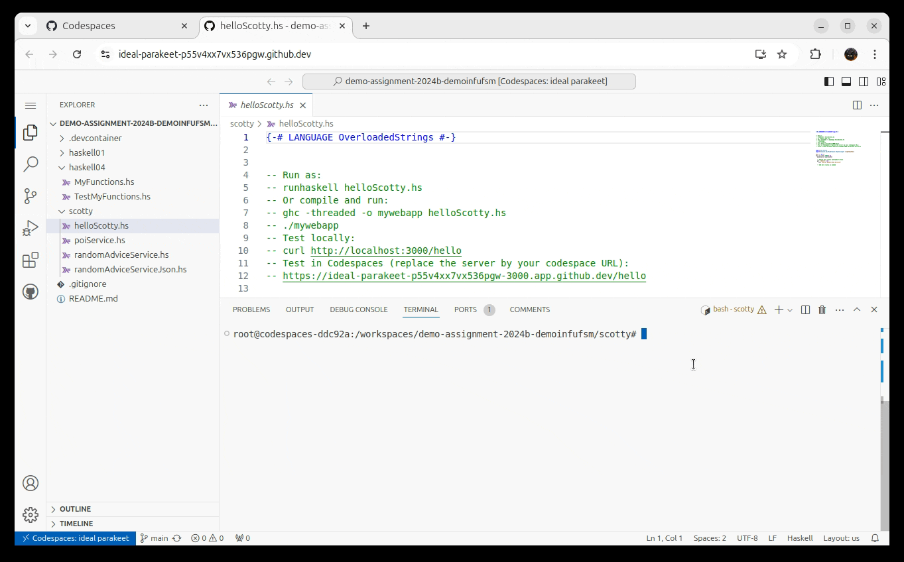

<!--
author:   Andrea Charão

email:    andrea@inf.ufsm.br

version:  0.0.1

language: PT-BR

narrator: Brazilian Portuguese Female

comment:  Material de apoio para a disciplina
          ELC117 - Paradigmas de Programação
          da Universidade Federal de Santa Maria

translation: English  translations/English.md

link:     https://cdn.jsdelivr.net/chartist.js/latest/chartist.min.css

script:   https://cdn.jsdelivr.net/chartist.js/latest/chartist.min.js

-->

<!--
nvm use v14.21.1
liascript-devserver --input README.md --port 3001 --live
https://liascript.github.io/course/?https://raw.githubusercontent.com/AndreaInfUFSM/elc117-2023b/master/classes/09/README.md
-->

[](https://liascript.github.io/course/?https://raw.githubusercontent.com/AndreaInfUFSM/elc117-2024b/main/projects/scotty/README.md)

# Web Service em Haskell


## Scotty

- Scotty é uma biblioteca em Haskell para construção de backend web
- Internamente, contém um servidor HTTP


### Exemplo mínimo


Arquivo: [src/Main.hs](src/helloScotty.hs)

``` haskell
import Web.Scotty
import Network.Wai.Middleware.RequestLogger (logStdoutDev)

main :: IO ()
main = scotty 3000 $ do
  middleware logStdoutDev

  -- Define your routes and handlers here
  get "/hello" $ do
    text "Hello, Haskell Web Service!"

```

### Outros exemplos

- [randomAdviceService.hs](src/randomAdviceService.hs)
- [randomAdviceServiceJson.hs](src/randomAdviceServiceJson.hs)
- [poiService.hs](src/poiService.hs)


### Instalação

```
cabal update
cabal install --lib scotty wai-extra random text
```

### Compilação e execução


Execução como script:

```
runhaskell helloScotty.hs
```

Opcional, com geração de executável:

```
ghc -threaded -o mywebapp helloScotty.hs
./mywebapp
```


### Teste

Exemplos de URLs ativas quando o Codespace estiver ativo (substituir o servidor pelo nome que for gerado para o seu codespace):

- https://ideal-parakeet-p55v4xx7vx536pgw-3000.app.github.dev/hello
- https://ideal-parakeet-p55v4xx7vx536pgw-3000.app.github.dev/advice
- https://ideal-parakeet-p55v4xx7vx536pgw-3000.app.github.dev/poi
- https://ideal-parakeet-p55v4xx7vx536pgw-3000.app.github.dev/poilist
- https://ideal-parakeet-p55v4xx7vx536pgw-3000.app.github.dev/near/-29.71689/-53.72968


#### Desenvolvimento / teste no Codespaces:





#### Desenvolvimento / teste local:

Opção 1: Abra um navegador e digite a URL: `http://localhost:3000/advice`

Opção 2: Use o programa `curl` no terminal: 

```
curl http://localhost:3000/advice
```


